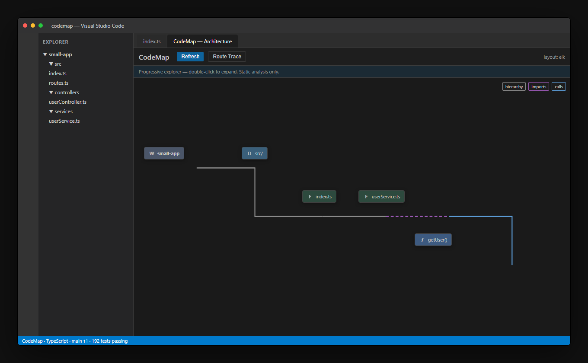
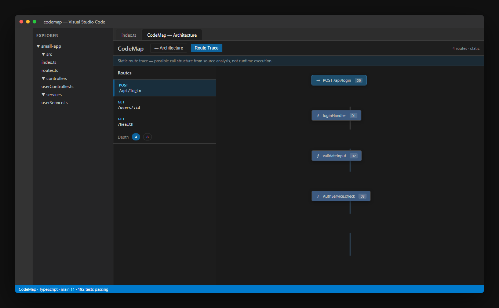
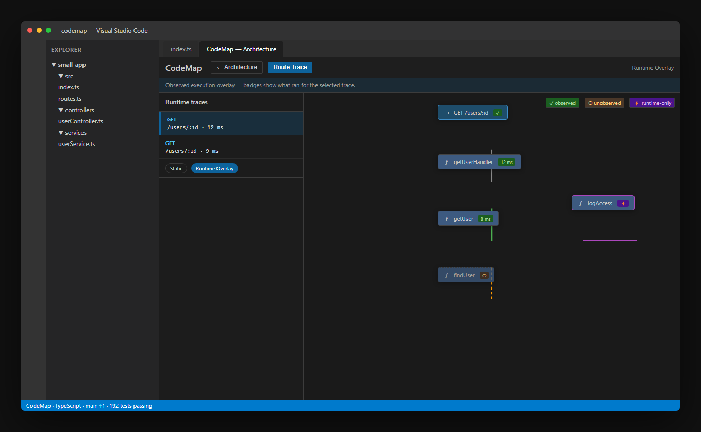
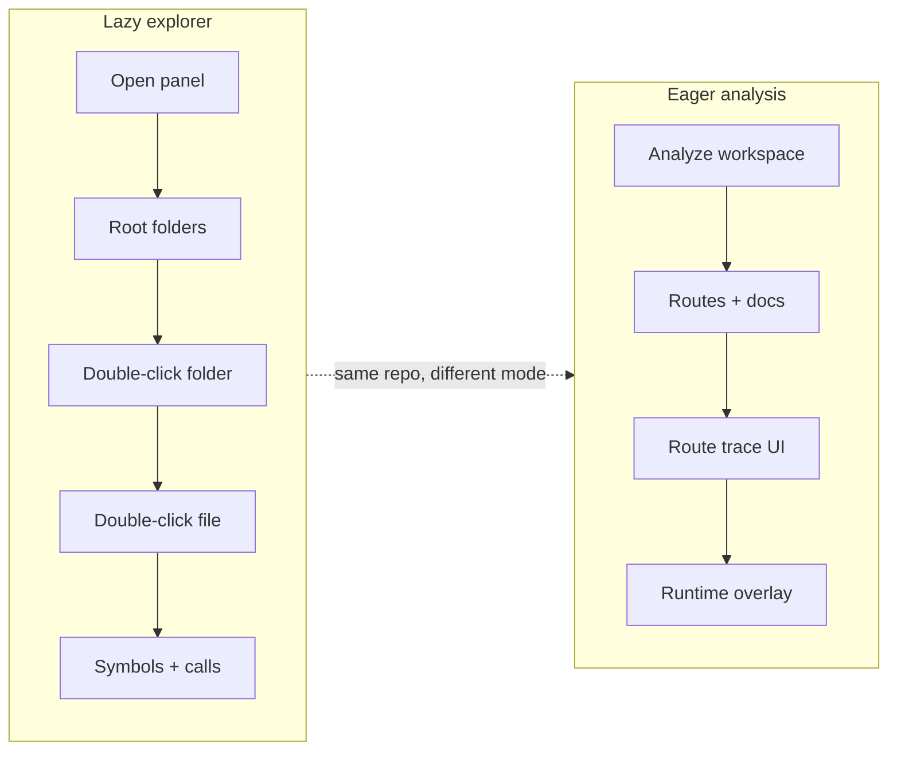
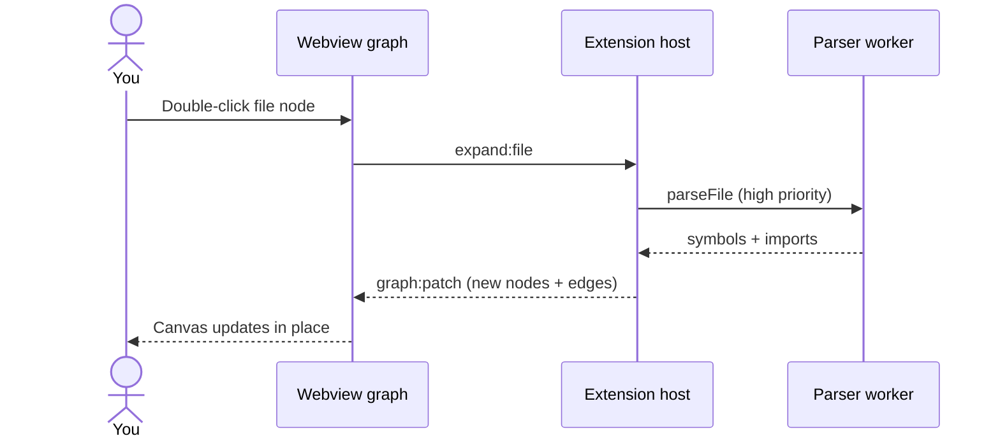
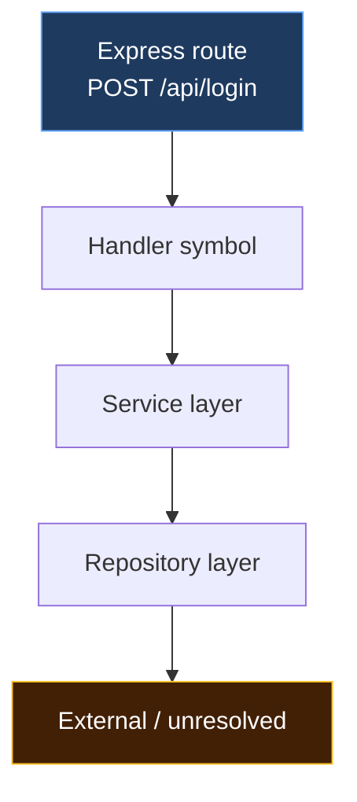
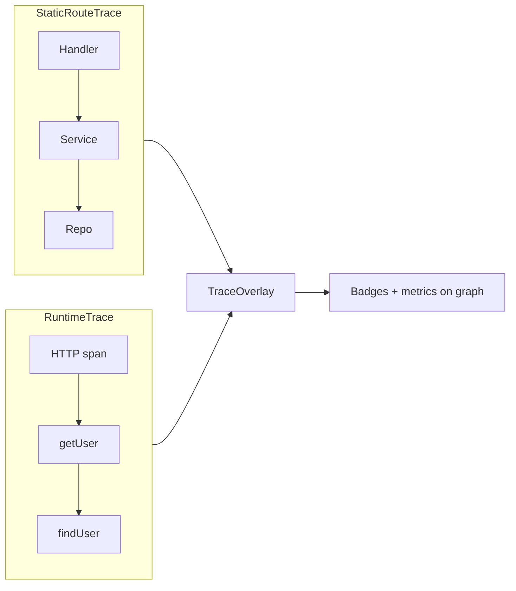
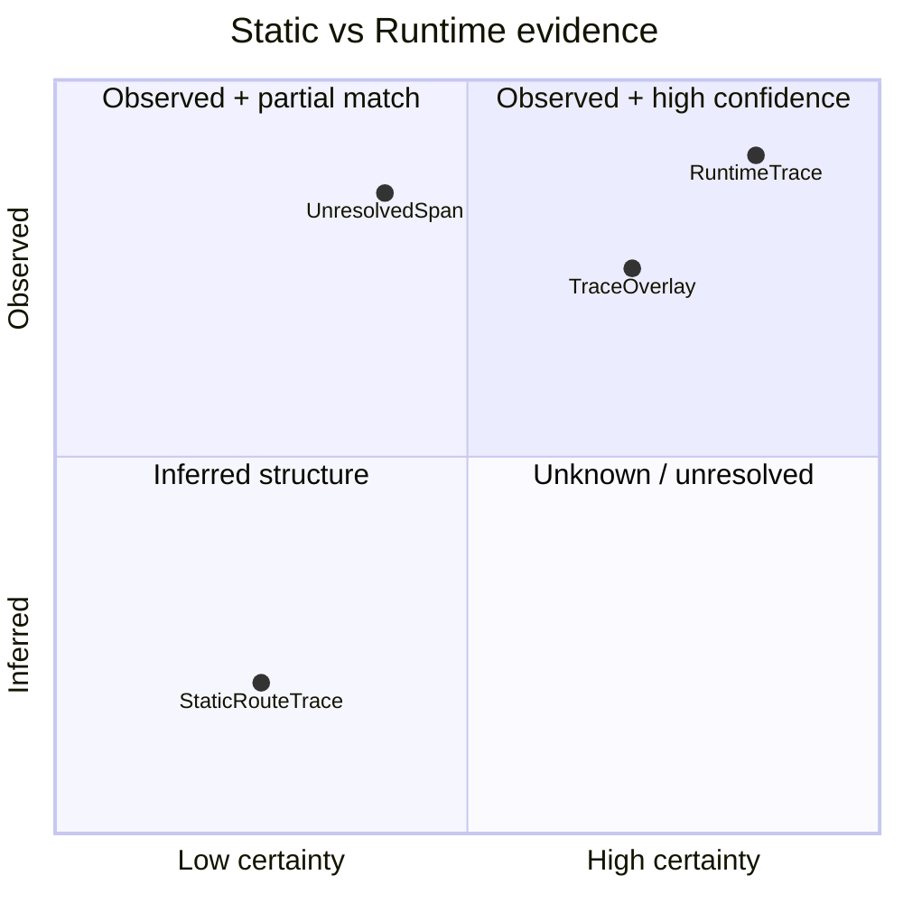
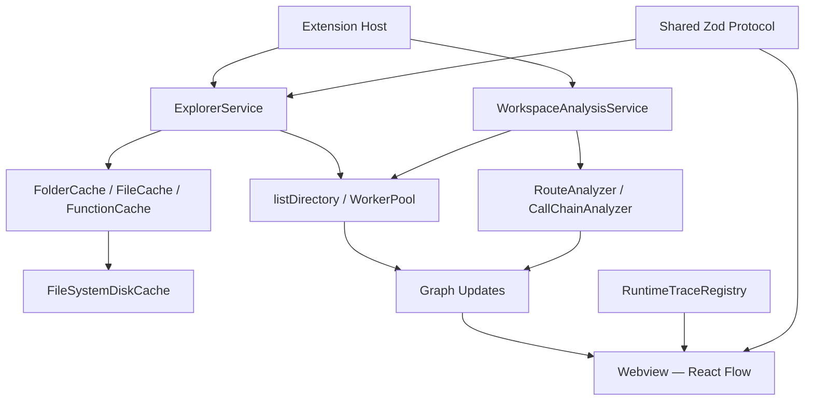

# CodeMap

[](LICENSE)
[](https://www.typescriptlang.org/)
[](https://code.visualstudio.com/)
[](https://nodejs.org/)
[](#validation)

> **Explore your codebase like a map** — expand folders, trace Express routes, and overlay live runtime spans inside VS Code.

Interactive VS Code extension that visualizes TypeScript and JavaScript workspaces as a progressive architecture explorer — folders, files, symbols, call edges, HTTP routes, and optional runtime traces.

Built with **React Flow**, **ELK**, and a worker-thread TypeScript parser so large monorepos stay responsive.

<p align="center">
  <a href="#live-demos-interactive-walkthroughs">
    
  </a>
</p>

<p align="center">
  <a href="#demo-2--route-trace--static-call-chains-from-express-handlers"></a>
  &nbsp;
  <a href="#demo-3--runtime-overlay--observed-execution-on-top-of-static-structure"></a>
</p>

<p align="center"><sub>Architecture explorer · static route trace · runtime overlay</sub></p>

---

## Jump to

| | | |
|---|---|---|
| [Why CodeMap?](#why-codemap) | [Live demos](#live-demos-interactive-walkthroughs) | [Quick start](#quick-start) |
| [Features](#features-at-a-glance) | [Static vs runtime](#static-vs-runtime-whats-the-difference) | [Architecture](#architecture) |
| [Scripts & benchmarks](#scripts) | [Documentation](#documentation) | [Contributing](#contributing) |

---

## Why CodeMap?

Most architecture tools try to draw the entire repository at once. CodeMap does the opposite: it paints the workspace root in under ~200ms, then expands only what you double-click. That keeps exploration fast, memory bounded, and honest about what static analysis can see.



---

## Live demos (interactive walkthroughs)

GitHub renders the sections below as **expandable panels** — click each heading to step through a demo flow.

<details open>
<summary><strong>Demo 1 — Architecture explorer</strong> · lazy, on-demand graph expansion</summary>

<br>

**What you see:** a React Flow canvas beside your editor. Only what you expand is parsed.


**Try it:**

1. `F5` → Extension Development Host
2. Command Palette → **CodeMap: Open Architecture**
3. Double-click a folder → file → function
4. `Ctrl/Cmd+double-click` any node → jump to source



| Gesture | Result |
|---------|--------|
| Double-click folder | List immediate children |
| Double-click file | Parse AST → symbols + import edges |
| Double-click function | Resolve direct callees |
| Ctrl/Cmd+double-click | Open file at symbol line |

</details>

<details>
<summary><strong>Demo 2 — Route trace</strong> · static call chains from Express handlers</summary>

<br>

**What you see:** every HTTP route in your workspace, plus a depth-filtered call graph from each handler.


**Try it:**

1. Command Palette → **CodeMap: Generate Architecture Document** (or analyze workspace)
2. Click **Route Trace** in the toolbar
3. Pick a route from the selector
4. Drag the depth slider — graph filters instantly (no re-analysis)



| Indicator | Meaning |
|-----------|---------|
| Solid edge | Resolved static call |
| Dashed edge | Unresolved / dynamic |
| Cycle badge | Recursive or circular path |
| External node | Outside workspace boundary |

</details>

<details>
<summary><strong>Demo 3 — Runtime overlay</strong> · observed execution on top of static structure</summary>

<br>

**What you see:** the same route trace graph with badges showing what actually ran when you hit your Express server.


**Try it:**

1. In your Express app: `instrumentExpress(app, { collector })`
2. Send a few requests to your API
3. In Route Trace → switch **Static** → **Runtime Overlay**
4. Select a completed trace from the dropdown



**Telemetry boundary:** method, route template, status code, and explicit span names only — no headers, cookies, or bodies.

</details>

<details>
<summary><strong>Demo 4 — Architecture document</strong> · agent-ready PROJECT_ARCHITECTURE.md</summary>

<br>

**What you get:** a deterministic markdown summary of modules, entry points, dependencies, and limitations.

```text
┌─ PROJECT_ARCHITECTURE.md ──────────────────────────────────────────────┐
│  ## Entry Points                                                       │
│  - src/index.ts  (package.json main)                                   │
│                                                                        │
│  ## Stack                                                              │
│  TypeScript · Express · ...                                            │
│                                                                        │
│  ## Major Modules                                                      │
│  src/controllers/  ·  src/services/  ·  src/routes/                    │
│                                                                        │
│  ## Known Limitations                                                  │
│  Dynamic dispatch may not appear in static graphs                      │
└────────────────────────────────────────────────────────────────────────┘
```

**Try it:**

| Command | Action |
|---------|--------|
| **CodeMap: Generate Architecture Document** | Write `PROJECT_ARCHITECTURE.md` |
| **CodeMap: Update Architecture Document** | Refresh existing doc |
| **CodeMap: Copy Agent Context** | Condensed context to clipboard |

</details>

---

## Visual gallery

Screenshots are captured from a faithful VS Code + CodeMap UI preview (`docs/assets/readme/screenshot-*.html`). To regenerate after UI changes:

```bash
npx serve docs/assets/readme -p 8765
npx playwright screenshot http://127.0.0.1:8765/screenshot-architecture.html docs/assets/readme/architecture-explorer.png --viewport-size=1360,840
npx playwright screenshot http://127.0.0.1:8765/screenshot-route.html docs/assets/readme/route-trace-static.png --viewport-size=1360,840
npx playwright screenshot http://127.0.0.1:8765/screenshot-runtime.html docs/assets/readme/runtime-overlay.png --viewport-size=1360,840
```

<details>
<summary><strong>Gallery — all three modes side by side</strong></summary>

<br>

| Architecture explorer | Static route trace | Runtime overlay |
|---|---|---|
|  |  |  |

</details>

---

## Static vs runtime: what's the difference?

<details>
<summary><strong>Compare modes</strong> (expand for full breakdown)</summary>

| | Static analysis | Runtime tracing |
|---|---|---|
| **Question answered** | *What could the code do?* | *What did it do this time?* |
| **Data source** | Source files + tsconfig | `instrumentExpress()` events |
| **Cost** | One-time workspace scan | Per-request overhead (~20–60 µs CPU) |
| **UI** | Route Trace → Static | Route Trace → Runtime Overlay |
| **Deterministic?** | Yes — same source → same graph | No — timestamps vary per run |



</details>

---

## Features at a glance

| Feature | Description |
|---------|-------------|
| **Instant startup** | Root folders and files only — no full-workspace parse on open |
| **Progressive exploration** | Double-click folders → files → symbols → call flow |
| **Express route intelligence** | AST extraction of `app.get`, routers, mounts, nested prefixes |
| **Static call tracing** | Multi-hop BFS from route handlers (configurable depth) |
| **Route trace UI** | Dedicated view with route selector, depth filter, source navigation |
| **Runtime overlay** | Observed / unobserved / runtime-only badges on the trace graph |
| **Architecture docs** | Deterministic `PROJECT_ARCHITECTURE.md` + agent context |
| **Multi-layer caching** | In-memory + disk persistence under `~/.codemap/cache` |
| **Parallel parsing** | Worker-thread TypeScript AST in a priority pool |
| **Production hardening** | Benchmarks, retention policies, cancellation, failure recovery |

**Limits:** static analysis only for structure. Dynamic dispatch and runtime-only calls may be missing (shown in UI banners).

---

## Quick start

<details open>
<summary><strong>Install & run</strong> — expand for copy-paste commands</summary>

### Prerequisites

- [Node.js](https://nodejs.org/) 18+
- [Visual Studio Code](https://code.visualstudio.com/) 1.85+

### From source

```bash
git clone https://github.com/nipulsh/codemap.git
cd codemap
npm install
npm run compile
```

Press **F5** to launch the Extension Development Host, then:

| Step | Command / action |
|------|------------------|
| 1 | `Ctrl/Cmd+Shift+P` → **CodeMap: Open Architecture** |
| 2 | Explore by double-clicking nodes |
| 3 | Optional: **CodeMap: Open Route Trace** for HTTP routes |
| 4 | Optional: **CodeMap: Generate Architecture Document** |

</details>

---

## Scripts

| Script | Purpose |
|--------|---------|
| `npm run compile` | Bundle extension, worker, and webview |
| `npm run watch` | Rebuild on file changes |
| `npm run typecheck` | TypeScript check (extension + webview) |
| `npm run test:unit` | Fixture and protocol unit tests (192) |
| `npm run lint` | ESLint over `src`, `shared`, and `tests` |
| `npm run benchmark` | All performance suites → `benchmark-results/REPORT.md` |
| `npm run benchmark:workspace` | Workspace analysis, lazy-vs-eager, document size |
| `npm run benchmark:static` | Route analysis, call chains, graph projection |
| `npm run benchmark:runtime` | Trace overlay, collector stress, instrumentation overhead |

---

## Production scope

CodeMap ships two complementary modes:

| Mode | Entry point | Purpose |
|------|-------------|---------|
| **Lazy explorer** | `ExplorerService` | Interactive folder/file/symbol expansion on demand |
| **Eager analysis** | `WorkspaceAnalysisService` | Full-workspace scan, routes, call chains, architecture docs |

**Express instrumentation** (opt-in):

```typescript
import express from 'express';
import { instrumentExpress } from 'codemap/runtime'; // your import path
import { getRuntimeTraceCollector } from './traceRegistry';

const app = express();
instrumentExpress(app, { collector: getRuntimeTraceCollector() });
```

---

## Usage

| Action | Effect |
|--------|--------|
| **CodeMap: Open Architecture** | Open or reveal the architecture panel |
| **CodeMap: Open Route Trace** | Switch to route trace view |
| **CodeMap: Refresh Graph** | Clear caches and re-expand explored nodes |
| **CodeMap: Generate Architecture Document** | Write `PROJECT_ARCHITECTURE.md` |
| Double-click folder / file / function | Progressive expansion |
| Ctrl/Cmd+double-click | Open source at symbol |

---

## Architecture



| Component | Role |
|-----------|------|
| **ExplorerService** | Lazy folder / file / function expansion |
| **WorkspaceAnalysisService** | Eager full-workspace pipeline |
| **WorkerPool** | Background TypeScript AST parsing |
| **RouteAnalyzer** | Express route extraction |
| **CallChainAnalyzer** | Static multi-hop call tracing |
| **TraceCollector** | Runtime span ingestion + retention |
| **TraceOverlay** | Static ↔ runtime correlation for UI |

For engineer-oriented deep dives, see [`docs/`](docs/README.md).

---

## Validation

| Check | Status |
|-------|--------|
| Unit tests | 192 passing |
| Typecheck | pass |
| Lint | pass |
| Benchmarks | `npm run benchmark` |

---

## Roadmap

| Phase | Focus |
|-------|-------|
| **Done** | Lazy explorer, cache, file watcher, call edges |
| **Done** | Workspace analysis, Express routes, call tracing, route trace UI |
| **Done** | Runtime protocol, instrumentation, overlay UI, production hardening |
| **Future** | Fastify/Next.js instrumentation, search/filter polish, Marketplace |

---

## Documentation

| Doc | Audience |
|-----|----------|
| [docs/README.md](docs/README.md) | Index and reading order |
| [Project overview](docs/01-project-overview.md) | Product goals |
| [Architecture](docs/04-architecture.md) | Module responsibilities |
| [Storage & cache](docs/09-database.md) | Cache design |
| [Contributing](CONTRIBUTING.md) | Fork, build, test, PR |

---

## Contributing

```bash
git checkout -b feature/your-change
npm install && npm run compile && npm run test:unit
# F5 → verify in Extension Development Host
```

See [CONTRIBUTING.md](CONTRIBUTING.md) for full guidelines.

---

## License

MIT — see [LICENSE](LICENSE).

## Acknowledgments

- [React Flow](https://reactflow.dev/) — interactive node canvases
- [ELK.js](https://github.com/kieler/elkjs) — automatic layered layout
- [Zod](https://zod.dev/) — runtime schema validation
- [VS Code Extension API](https://code.visualstudio.com/api) — host platform
