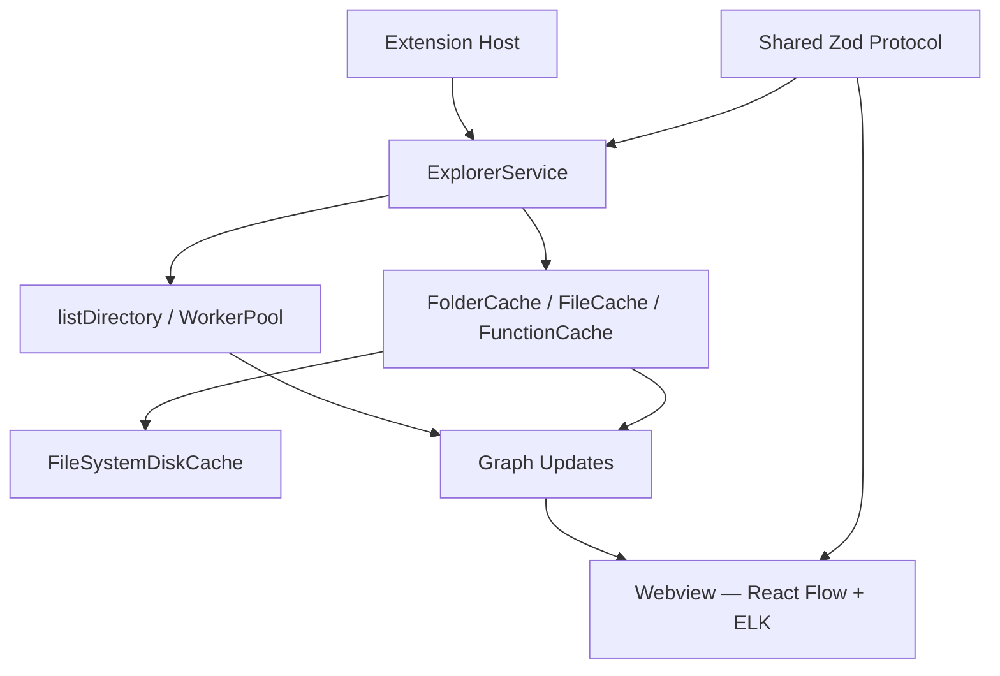

# CodeMap

[](LICENSE)
[](https://www.typescriptlang.org/)
[](https://code.visualstudio.com/)
[](https://nodejs.org/)

Interactive VS Code extension that visualizes TypeScript and JavaScript workspaces as a progressive architecture explorer — folders, files, symbols, and call edges on demand.

Built with **React Flow**, **ELK**, and a worker-thread TypeScript parser so large monorepos stay responsive.

## Why CodeMap?

Most architecture tools try to draw the entire repository at once. CodeMap does the opposite: it paints the workspace root in under ~200ms, then expands only what you double-click. That keeps exploration fast, memory bounded, and honest about what static analysis can see.

## Features

| Feature | Description |
|---------|-------------|
| **Instant startup** | Root folders and files only — no full-workspace parse on open |
| **Progressive exploration** | Double-click folders → files → symbols → call flow (n8n-style) |
| **Direct editing** | Ctrl/Cmd+double-click opens the file at the right line |
| **Multi-layer caching** | In-memory folder / file / function caches plus disk persistence under `~/.codemap/cache` |
| **Efficient updates** | File watcher invalidates and re-expands only changed paths |
| **Background prefetch** | After folder expand, low-priority parse into the file cache |
| **Parallel parsing** | Worker-thread TypeScript AST (imports, exports, symbols, direct calls) |
| **Typed protocol** | Zod-validated messages between extension host and webview |

**Limits:** static analysis only. Dynamic dispatch and runtime-only calls are not shown (indicated by a banner in the UI).

## Quick start

### Prerequisites

- [Node.js](https://nodejs.org/) 18 or newer
- [Visual Studio Code](https://code.visualstudio.com/) 1.85+

### From source

```bash
git clone https://github.com/nipulsh/codemap.git
cd codemap
npm install
npm run compile
```

Press **F5** to launch the Extension Development Host, then run **CodeMap: Open Architecture** from the Command Palette (`Ctrl/Cmd+Shift+P`).

### Scripts

| Script | Purpose |
|--------|---------|
| `npm run compile` | Bundle extension, worker, and webview |
| `npm run watch` | Rebuild on file changes |
| `npm run typecheck` | TypeScript check (extension + webview) |
| `npm run test:unit` | Fixture and protocol unit tests |
| `npm run lint` | ESLint over `src`, `shared`, and `tests` |

## Usage

| Action | Effect |
|--------|--------|
| **CodeMap: Open Architecture** | Open or reveal the architecture panel |
| **CodeMap: Refresh Graph** | Clear caches and re-expand explored nodes |
| Double-click folder | Show immediate children |
| Double-click file | Parse AST → symbols + import edges |
| Double-click function | Resolve direct callees (file stub if target not expanded) |
| Expand target file later | Rewire call edges from stubs to concrete symbols |
| Ctrl/Cmd+double-click | Open the source file in the editor |

## Architecture



| Component | Role |
|-----------|------|
| **ExplorerService** | Lazy folder / file / function expansion and graph patches |
| **WorkerPool** | Node worker threads for TypeScript AST parsing |
| **FolderCache** | Directory listings |
| **FileCache** | Parsed file results, backed by disk cache |
| **FunctionCache** | Function → callee resolution |
| **FileSystemDiskCache** | Persists parse results under `~/.codemap/cache` (24h TTL) |
| **MessageBus** | Strongly typed host ↔ webview messages (`shared/messages.ts`) |

For engineer-oriented deep dives, see [`docs/`](docs/README.md).

## Roadmap

| Phase | Focus |
|-------|-------|
| **Done** | Lazy explorer, multi-layer cache, file watcher, prefetch, call edges, disk persistence |
| **Next** | Search / filter UI, multi-worker pool, layout and clustering polish |
| **Future** | Richer call resolution, import/export graphs, theme support, Marketplace publish |

## Documentation

| Doc | Audience |
|-----|----------|
| [docs/README.md](docs/README.md) | Index and reading order for contributors |
| [Project overview](docs/01-project-overview.md) | Product goals and high-level flow |
| [Architecture](docs/04-architecture.md) | Module responsibilities |
| [Storage & cache](docs/09-database.md) | In-memory + disk cache design |
| [Cache improvements](docs/CACHE_IMPROVEMENTS_SUMMARY.md) | Disk cache implementation notes |
| [Debugging guide](docs/16-debugging-guide.md) | When something breaks |
| [Contributing](CONTRIBUTING.md) | How to fork, build, test, and PR |

## Contributing

Contributions are welcome. See [CONTRIBUTING.md](CONTRIBUTING.md) for setup, style, and PR guidelines.

```bash
git checkout -b feature/your-change
npm install && npm run compile && npm run test:unit
# F5 → verify in Extension Development Host
```

## License

MIT — see [LICENSE](LICENSE).

## Acknowledgments

- [React Flow](https://reactflow.dev/) — interactive node canvases
- [ELK.js](https://github.com/kieler/elkjs) — automatic layered layout
- [Zod](https://zod.dev/) — runtime schema validation
- [VS Code Extension API](https://code.visualstudio.com/api) — host platform
