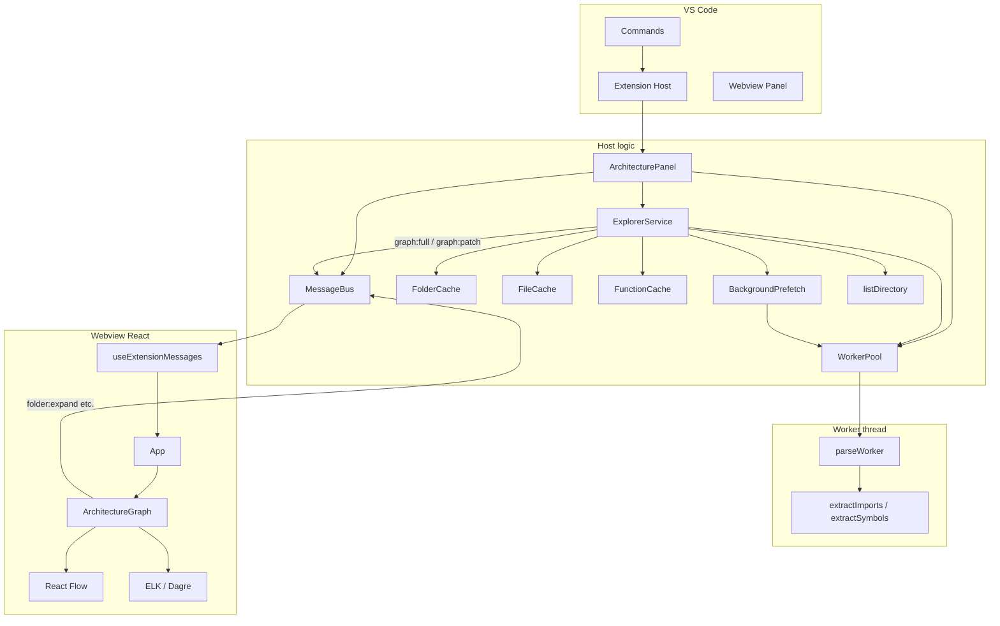

# 01 — Project Overview

## What this project is

**CodeMap** is a Visual Studio Code extension that turns a TypeScript/JavaScript workspace into an interactive **architecture graph**. Instead of dumping every file into one giant diagram on open, it behaves like a progressive explorer:

1. Open the panel → see the workspace root and its immediate children.
2. Double-click a folder → reveal that folder’s children.
3. Double-click a file → parse the AST and show symbols plus import edges.
4. Double-click a function → resolve direct callees as call edges.
5. Ctrl/Cmd+double-click → open the file in the editor at the right line.

The product goal is **fast first paint** and **on-demand depth**, so large monorepos remain usable.

## Main features

| Feature | Behavior |
|---------|----------|
| Open Architecture | Creates/reveals the webview panel and bootstraps the root graph |
| Refresh Graph | Clears caches and re-expands previously expanded nodes |
| Lazy folder expand | Non-recursive directory listing + hierarchy edges |
| File expand | Worker-thread parse → symbols (`contains`), imports, dynamic imports |
| Function expand | Resolve callees → `calls` edges (file stub if target not expanded) |
| Call rewiring | Expanding a target file upgrades stub call edges to symbol nodes |
| Background prefetch | After folder expand, low-priority parse into `FileCache` only |
| File system watcher | Invalidates and re-expands changed paths |
| Layout | ELK layered layout with Dagre fallback; incremental placement for patches |

**Limits:** static analysis only. Dynamic dispatch, reflection, and runtime-only calls are not shown (UI banner).

## Overall architecture



### Layer summary

| Layer | Responsibility |
|-------|----------------|
| Extension entry | Register commands; create panel |
| ArchitecturePanel | Own panel, bus, pool, explorer, watcher |
| ExplorerService | Business logic for expand/collapse/refresh |
| Scanner | List directories (live) or full-scan (tests) |
| Parser + Worker | TypeScript AST → imports/symbols/calls |
| Cache | In-memory folder / file / function results |
| Shared protocol | Zod-validated messages and graph model |
| Webview | Render graph; send user actions |

## Technologies used

| Tech | Where / why |
|------|-------------|
| VS Code Extension API | Commands, webview panel, FS watcher, open document |
| TypeScript (compiler API) | Parse source files, resolve modules, walk AST |
| Node `worker_threads` | Keep heavy parsing off the extension host UI thread |
| Zod | Validate graph + message payloads on both sides |
| React 18 | Webview UI |
| `@xyflow/react` (React Flow) | Interactive node-edge canvas |
| `elkjs` | Primary auto-layout (layered, left-to-right) |
| `@dagrejs/dagre` | Fallback layout if ELK fails/times out |
| esbuild | Bundle extension (CJS), worker (CJS), webview (IIFE) |
| tsx + Node test runner | Unit tests under `tests/` |

## High-level execution flow

```mermaid
sequenceDiagram
  participant User
  participant VSCode
  participant Activate as activate.ts
  participant Panel as ArchitecturePanel
  participant Explorer as ExplorerService
  participant Webview

  User->>VSCode: CodeMap: Open Architecture
  VSCode->>Activate: command handler
  Activate->>Panel: createOrShow + bootstrap
  Panel->>Webview: set HTML (main.js)
  Webview->>Panel: ready
  Panel->>Explorer: bootstrap(workspaceRoot)
  Explorer->>Explorer: listDirectory(root)
  Explorer->>Panel: emit graph:full
  Panel->>Webview: graph:full
  Webview->>Webview: layoutGraph + React Flow
  User->>Webview: double-click folder
  Webview->>Panel: folder:expand
  Panel->>Explorer: expandFolder
  Explorer->>Panel: emit graph:patch
  Panel->>Webview: graph:patch
```

1. User runs **CodeMap: Open Architecture** (or Refresh).
2. `activate` creates/reveals `ArchitecturePanel`.
3. Panel constructs `MessageBus`, `WorkerPool`, `ExplorerService`, loads webview HTML, starts a `**/*` watcher.
4. Command calls `bootstrap()`; webview also sends `ready` which may call `bootstrap()` again (guarded by `busy`).
5. Explorer lists the workspace root only → posts `graph:full`.
6. Webview lays out and renders.
7. Further interaction is patch-driven.

## Two pipelines

| Pipeline | Entry | Used by |
|----------|-------|---------|
| **Lazy explorer (live)** | `listDirectory` → `ExplorerService` | Architecture panel / UI |
| **Full snapshot (tests)** | `scanWorkspace` → parse → `generateGraph` | `tests/helpers.ts` and fixture tests |

Do not assume the live panel calls `scanWorkspace` or `generateGraph` — it does not.

## What does not exist (yet)

- No database
- No disk cache persistence (`NoOpDiskCache` stub only)
- No search/filter UI (schemas exist; handlers are no-ops)
- No multi-worker pool (single worker + priority queue)

See [09-database.md](09-database.md) and [14-design-decisions.md](14-design-decisions.md).

## Related docs

- [02-folder-structure.md](02-folder-structure.md) — where code lives
- [03-runtime-flow.md](03-runtime-flow.md) — detailed startup steps
- [04-architecture.md](04-architecture.md) — module catalog
