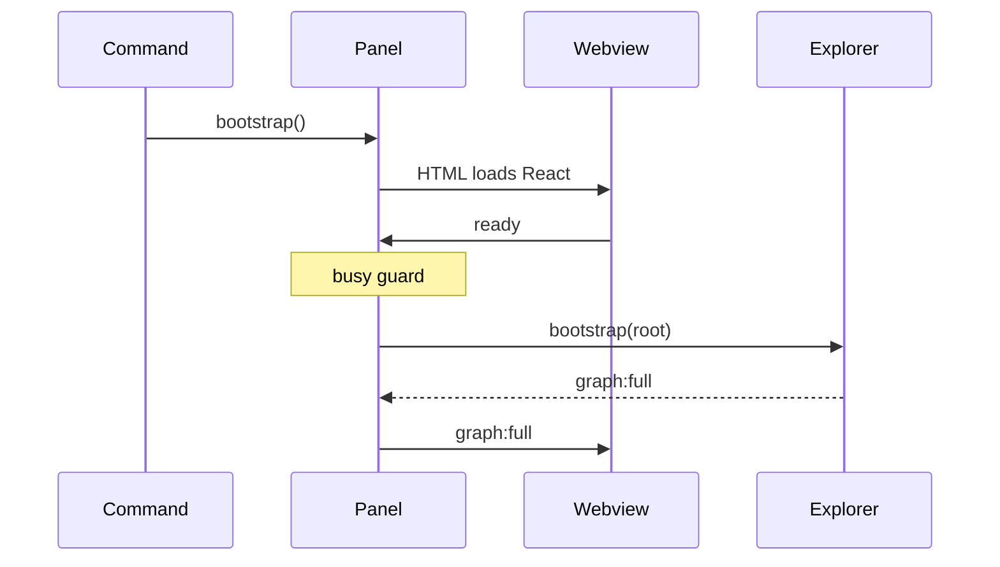
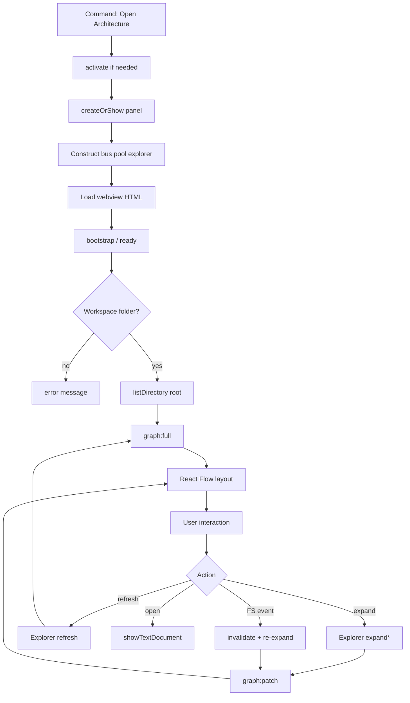

# 03 — Runtime Flow

Exact runtime behavior from process start through first paint and common follow-ons.

## 0. Prerequisites

1. `npm run compile` (or F5’s preLaunch task) produces:
   - `out/extension.js`
   - `out/parser/workers/parseWorker.js`
   - `out/webview/main.js`
2. User opens a workspace folder in VS Code.
3. Extension is not yet activated (`activationEvents` is empty; contributing commands activates on first use).

---

## 1. Extension activates

```
User runs "CodeMap: Open Architecture"
        ↓
VS Code loads package.json main → out/extension.js
        ↓
activate(context) in src/extension/activate.ts
        ↓
Registers:
  - codemap.openArchitecture
  - codemap.refreshGraph
        ↓
openArchitecture handler runs
```

**Code:** [`src/extension/activate.ts`](../src/extension/activate.ts)

---

## 2. Panel is created or revealed

```
ArchitecturePanel.createOrShow(extensionUri)
        ↓
If ArchitecturePanel.current exists → reveal + return
        ↓
Else createWebviewPanel('codemapArchitecture', …)
        ↓
new ArchitecturePanel(panel, extensionUri)
```

**Constructor does:**

| Step | What |
|------|------|
| MessageBus | Wrap `panel.webview` |
| WorkerPool | Point at `out/parser/workers/parseWorker.js` |
| ExplorerService | Pass pool + emit bridge → bus posts |
| HTML | CSP + script/style URIs |
| onMessage | Route webview messages |
| onDidDispose | `dispose()` |
| FileSystemWatcher | `**/*` create/change/delete |

Worker is **not** started yet — `WorkerPool` creates the thread lazily on first parse.

---

## 3. Bootstrap is requested (twice is OK)

Two callers may request bootstrap:

1. Command handler: `void panel.bootstrap()`
2. Webview mount: `postToExtension({ type: 'ready' })` → `handleWebviewMessage` → `bootstrap()`

`ArchitecturePanel.busy` ensures only one bootstrap/refresh runs at a time. The second call returns early if the first is still running; if the first finished, a second bootstrap resets the graph (usually fine because the first already completed).



---

## 4. Explorer bootstrap (root listing only)

```
ExplorerService.bootstrap(workspaceRoot)
        ↓
clearState()
        ↓
Create BackgroundPrefetch
        ↓
progress: "Loading workspace…"
        ↓
listDirectory(root, root)   // NON-recursive
        ↓
FolderCache.set(listing)
        ↓
Build Workspace node + child Folder/File nodes
        ↓
hierarchy edges from workspace → children
        ↓
emit { full: GraphSnapshot }
```

**No worker parse** happens during bootstrap unless later expands/prefetch require it.

---

## 5. Message bus → webview

```
Explorer emit { full }
        ↓
ArchitecturePanel emit bridge
        ↓
bus.post({ type: 'graph:full', payload })
        ↓
Zod parseExtensionToWebview
        ↓
webview.postMessage
        ↓
window 'message' listener in useExtensionMessages
        ↓
safeParseExtensionToWebview
        ↓
setSnapshot + fullVersion++
```

---

## 6. React Flow renders

```
App reads snapshot from hook
        ↓
ArchitectureGraph sees fullVersion change
        ↓
layoutGraph(snapshot)  // ELK ≤2s else Dagre
        ↓
setNodes / setEdges (React Flow)
        ↓
fitView
```

User sees the workspace root and immediate children.

---

## 7. Expand folder (example follow-on)

```
User double-clicks Folder node
        ↓
ArchitectureGraph posts { type: 'folder:expand', path }
        ↓
MessageBus validates
        ↓
Panel.handleWebviewMessage
        ↓
ExplorerService.expandFolder(path)
        ↓
FolderCache hit or listDirectory
        ↓
patch upsertNodes / upsertEdges (hierarchy)
        ↓
BackgroundPrefetch.enqueueFiles(source files)
        ↓
bus graph:patch
        ↓
webview applyGraphPatch + layoutNewNodes
```

Prefetch calls `WorkerPool.parseFiles({ priority: 'low' })` and fills `FileCache` **without** posting patches.

---

## 8. Expand file

```
file:expand
        ↓
ensureParsed → FileCache.getIfFresh OR pool.parseFile (high priority)
        ↓
Worker ensureWorker() if needed
        ↓
parseWorker → extractImports.parseFile
        ↓
Symbol nodes + contains edges
Import / dynamicImport edges (+ lazy file stubs)
Rewire prior call edges targeting this file stub
        ↓
graph:patch
```

---

## 9. Expand function

```
function:expand { nodeId }
        ↓
FunctionCache or pool.resolveCalls
        ↓
calls edges to local symbols / expanded symbols / file stubs
        ↓
graph:patch
```

---

## 10. Refresh

```
codemap.refreshGraph OR UI Refresh OR graph:refresh
        ↓
Panel.refresh()
        ↓
Remember expandedFolders / Files / Functions
        ↓
Clear all caches
        ↓
bootstrap(root) → graph:full
        ↓
Re-run expandFolder / expandFile / expandFunction for each
        ↓
series of graph:patch messages
```

---

## 11. Filesystem change

```
FileSystemWatcher onDidChange/Create/Delete
        ↓
handleFsEvent(uri)
        ↓
Directory → onDirectoryChanged
File → onFileChanged (+ parent directory)
        ↓
Invalidate caches
If still expanded → collapse then re-expand
        ↓
graph:patch
```

---

## 12. Dispose / deactivate

```
Panel closed OR deactivate()
        ↓
ArchitecturePanel.dispose()
        ↓
ArchitecturePanel.current = undefined
        ↓
explorer.dispose()  // cancel prefetch, clear maps
        ↓
pool.dispose()      // terminate worker
        ↓
panel.dispose()
        ↓
dispose watchers / message subscription
```

---

## Runtime flowchart (full)



## Related docs

- [17-extension-lifecycle.md](17-extension-lifecycle.md)
- [15-common-workflows.md](15-common-workflows.md)
- [10-workers.md](10-workers.md)
