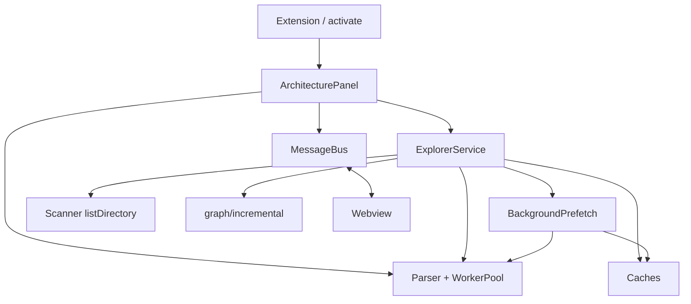

# 04 — Architecture

Major modules, their public APIs, dependencies, and lifecycles.

---

## 1. Extension (`src/extension/activate.ts`)

**Responsibilities**

- Register VS Code commands.
- Create or refresh the architecture panel.
- Dispose the panel on deactivation.

**Public API**

| Symbol | Role |
|--------|------|
| `activate(context)` | Register commands; push to `subscriptions` |
| `deactivate()` | `ArchitecturePanel.current?.dispose()` |

**Dependencies:** `ArchitecturePanel`, `vscode`.

**Lifecycle:** Called once per Extension Host session when a contributed command runs (or on explicit activation). `deactivate` when the extension unloads.

---

## 2. ArchitecturePanel (`src/extension/ArchitecturePanel.ts`)

**Responsibilities**

- Singleton webview host.
- Construct and own MessageBus, WorkerPool, ExplorerService.
- Route webview messages to explorer / editor APIs.
- Bridge explorer emits → bus posts.
- Watch the filesystem and invalidate explorer state.
- Serve webview HTML with CSP.

**Public API**

| Member | Role |
|--------|------|
| `static current` | Singleton instance |
| `static createOrShow(extensionUri)` | Reveal or create |
| `bootstrap()` | Initial root graph |
| `refresh()` | Re-explore expanded paths |
| `dispose()` | Tear down everything |

**Dependencies:** MessageBus, WorkerPool, ExplorerService, `isSourceFile`, `normalizePath`, VS Code APIs.

**Lifecycle:** Created on first Open Architecture; disposed when panel closes or extension deactivates. Worker starts lazily on first parse.

**Critical module** — most wiring lives here.

---

## 3. MessageBus (`src/extension/messageBus.ts`)

**Responsibilities**

- Validate and send extension→webview messages.
- Validate and dispatch webview→extension messages.
- Reject invalid inbound messages with an `error` post.

**Public API**

| Method | Role |
|--------|------|
| `post(message)` | Zod-parse then `webview.postMessage` |
| `onMessage(handler)` | Subscribe; returns `Disposable` |

**Dependencies:** `shared/messages.ts`, VS Code `Webview`.

**Lifecycle:** Lives as long as the panel. Not a global singleton beyond the panel instance.

---

## 4. ExplorerService (`src/explorer/ExplorerService.ts`)

**Responsibilities**

- Own the live graph maps (`nodeMap`, `edgeMap`).
- Own three caches and expansion sets.
- Implement bootstrap / refresh / expand / collapse.
- Emit full snapshots and patches via callback.
- Rewire call edges when files expand.
- Respond to FS invalidation.

**Public API**

| Method | Role |
|--------|------|
| `bootstrap(workspaceRoot)` | Root listing → `graph:full` |
| `refresh()` | Clear caches; bootstrap; re-expand |
| `expandFolder` / `collapseFolder` | Hierarchy children |
| `expandFile` / `collapseFile` | Parse + symbols + imports |
| `expandFunction` / `collapseFunction` | Call edges |
| `onFileChanged` / `onDirectoryChanged` | Invalidation |
| `dispose()` | Cancel prefetch; clear state |

**Emit shape (`ExplorerEmit`):** `{ full?, patch?, progress?, error? }`

**Dependencies:** FolderCache, FileCache, FunctionCache, listDirectory, WorkerPool, incremental graph helpers, BackgroundPrefetch.

**Lifecycle:** Created with the panel; disposed with the panel. State is ephemeral.

**Critical module** — product logic.

---

## 5. BackgroundPrefetch (`src/explorer/prefetch.ts`)

**Responsibilities**

- After folder expand, queue source files for low-priority parse.
- Fill FileCache only — never emit graph patches.

**Public API**

| Method | Role |
|--------|------|
| `enqueueFiles(paths)` | Filter source; skip cached/queued; run batches of 8 |
| `cancel()` | Stop further work |

**Dependencies:** WorkerPool, FileCache, ignore helpers, hash utils.

**Lifecycle:** Created per bootstrap; cancelled on clear/dispose.

---

## 6. Scanner (`src/scanner/`)

### Live: `listDirectory`

**Responsibilities:** Non-recursive directory listing; collect immediate folders, visible files, tsconfigs.

**Public API:** `listDirectory`, `findNearestTsConfig`, `workspaceLabel`.

### Test/full: `workspaceScanner`

**Responsibilities:** Recursive workspace walk for full graph tests.

**Public API:** `scanWorkspace`, `findTsConfigForFile`.

### Shared: `ignore`

**Public API:** `shouldIgnoreDirectory`, `shouldIgnoreFile`, `isSourceFile`.

**Lifecycle:** Stateless functions; no long-lived scanner service.

---

## 7. Parser + Workers (`src/parser/`)

**Responsibilities**

- Parse TypeScript/JavaScript into imports, exports, symbols, dependency paths.
- Resolve callees inside a named function.
- Run that work off the extension host thread.

**Public API (host):** `WorkerPool.parseFiles`, `parseFile`, `resolveCalls`, `dispose`.

**Public API (library, used inside worker):** `parseFiles`, `parseFile`, `resolveCalls`, `extractSymbols`, `resolveFunctionCallees`.

**Dependencies:** TypeScript compiler API, Node `worker_threads`.

**Lifecycle:** Pool owned by panel; worker created on first job; terminated on dispose. See [10-workers.md](10-workers.md).

---

## 8. Graph builders (`src/graph/`)

| Module | Role | Consumer |
|--------|------|----------|
| `incremental.ts` | IDs, makeNode/Edge, applyPatchToMaps | Explorer (live) |
| `generator.ts` | Full GraphSnapshot + cycle detection | Tests |

**Lifecycle:** Pure helpers / functions; no instance lifecycle.

---

## 9. Cache (`src/cache/`)

| Class | Stores | Freshness |
|-------|--------|-----------|
| `FolderCache` | `DirectoryListing` by path | Manual invalidate |
| `FileCache` | Parsed file + contentHash | `getIfFresh(path, hash)` |
| `FunctionCache` | Callees by symbol nodeId | Invalidate by file |
| `InMemoryDependencyIndex` | Indexed files for full graph | Tests |
| `NoOpDiskCache` | Nothing | Stub |

**Lifecycle:** Owned by ExplorerService (or tests); cleared on refresh/dispose.

---

## 10. Webview (`src/webview/`)

**Responsibilities**

- Render graph with React Flow.
- Layout full snapshots and place new patch nodes.
- Send expand/collapse/open/refresh/ready messages.
- Show progress/error banners.

**Public surface**

| Piece | Role |
|-------|------|
| `App` | Shell UI |
| `useExtensionMessages` | Snapshot state + messaging |
| `ArchitectureGraph` | Canvas + double-click handlers |
| `Nodes` | Per-kind React Flow nodes |
| `layoutGraph` / `layoutNewNodes` | Positioning |

**Dependencies:** React, React Flow, ELK, Dagre, shared graph/messages. Talks to host only via `acquireVsCodeApi().postMessage`.

**Lifecycle:** Starts when webview HTML loads; ends when panel is disposed (`retainContextWhenHidden: true` keeps JS state while hidden).

---

## Module criticality

| Priority | Modules |
|----------|---------|
| Critical | ArchitecturePanel, ExplorerService, shared messages/graph, WorkerPool |
| High | extractImports/extractSymbols, MessageBus, ArchitectureGraph |
| Medium | caches, listDirectory, autoLayout, prefetch |
| Low / stubs | Empty scanner stubs, diskCache no-op, scanProject command stub |

## Where new features should land

See [02-folder-structure.md](02-folder-structure.md#where-to-add-new-features) and [14-design-decisions.md](14-design-decisions.md).

## Related docs

- [05-module-breakdown.md](05-module-breakdown.md) — file-level detail
- [13-dependency-graph.md](13-dependency-graph.md) — why imports exist
