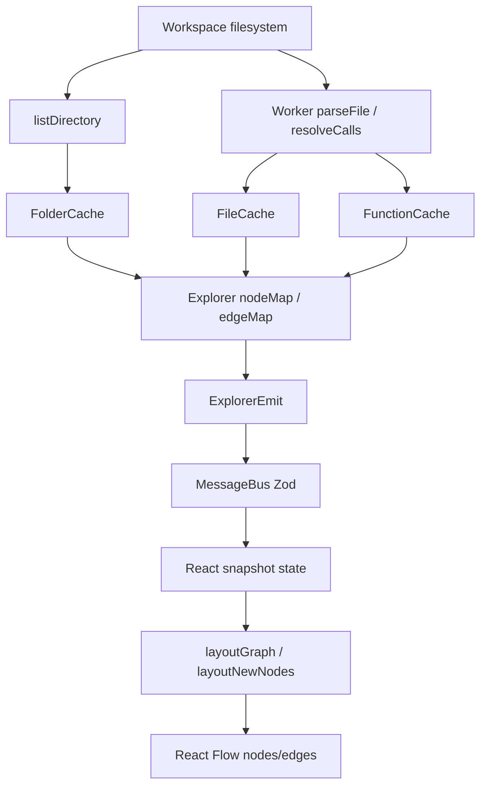
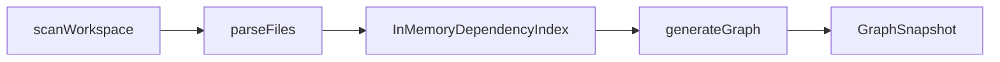

# 06 — Data Flow

How data moves and transforms from disk to pixels.

## End-to-end pipeline (live UI)



---

## Transformation stages

### 1. Filesystem → DirectoryListing

**Function:** `listDirectory(dirPath, workspaceRoot)` in [`src/scanner/listDirectory.ts`](../src/scanner/listDirectory.ts)

| Input | Output |
|-------|--------|
| Absolute directory path | `DirectoryListing` |

**Contains:**

- `folders[]` — name + absolute/relative paths
- `files[]` — `ScannedFile` (path, mtime, contentHash) for source + selected config/docs files
- `tsconfigs[]` — immediate `tsconfig*.json` children

**Filters:** ignored directories (`node_modules`, `dist`, …), test/generated source files, non-visible non-source files.

---

### 2. DirectoryListing → Graph nodes/edges (hierarchy)

**Function:** `ExplorerService.bootstrap` / `expandFolder`

| Input | Output |
|-------|--------|
| Listing | `GraphNode` (`Workspace`/`Folder`/`File`) + `hierarchy` edges |

**ID scheme** ([`src/graph/incremental.ts`](../src/graph/incremental.ts)):

| Kind | ID format |
|------|-----------|
| Workspace | `workspace:{normalizedRoot}` |
| Folder | `folder:{normalizedPath}` |
| File | `file:{normalizedPath}` |
| Symbol | `symbol:{path}:{Kind}:{name}` |
| Edge | `{kind}:{source}->{target}` |

Paths are normalized to POSIX-style via `normalizePath`.

---

### 3. Source file → FileParseResult

**Functions:** `WorkerPool.parseFile` → worker → `extractImports.parseFile`

| Input | Output |
|-------|--------|
| Absolute file path + tsconfigs | `FileParseResult` |

**Fields:**

- `imports` / `exports` — specs with resolved paths when possible
- `symbols` — functions, classes, interfaces, enums, components
- `dependencyPaths` — effective module deps after barrel hop
- `dynamicImportPaths` — dynamic `import()` targets
- `error?` — per-file failure string

Cached as `CachedFileParse` keyed by path; freshness via `contentHash`.

---

### 4. FileParseResult → symbol graph + import edges

**Function:** `ExplorerService.expandFile`

| Input | Output patch |
|-------|----------------|
| Parsed file | Symbol nodes + `contains` edges; `imports` / `dynamicImport` edges; lazy File stubs; optional call rewires |

**Metadata examples on File node:** `expanded`, `exportNames`, `importCount`, `parseError`, `lazy`.

---

### 5. Function body → CalleeRef[] → call edges

**Functions:** `resolveCalls` / `resolveFunctionCallees` → `expandFunction`

| Input | Output |
|-------|--------|
| filePath + functionName | `CalleeRef[]` then `calls` edges |

**Target resolution policy:**

1. Local callee → local symbol node if present.
2. Imported callee + target file expanded → target symbol node.
3. Else → File stub node (`metadata.lazy` / `collapsedTarget`).

Later `expandFile` on the stub runs `rewireCallsToFile` to retarget edges.

---

### 6. Explorer maps → messages

| Emit | Message |
|------|---------|
| `{ full: GraphSnapshot }` | `{ type: 'graph:full', payload }` |
| `{ patch: GraphPatch }` | `{ type: 'graph:patch', payload }` |
| `{ progress }` | `{ type: 'progress', payload }` |
| `{ error }` | `{ type: 'error', payload }` |

Validated by Zod before crossing the webview boundary.

---

### 7. Snapshot/patch → React Flow

**Hook:** `useExtensionMessages`

- `graph:full` replaces snapshot; bumps `fullVersion`.
- `graph:patch` runs `applyGraphPatch` (immutable).

**Component:** `ArchitectureGraph`

- Full version → `layoutGraph` (ELK/Dagre) → RF nodes with positions.
- Patch → `layoutNewNodes` places only new IDs; preserves dragged positions.

**RF conversion (conceptually):**

```
GraphNode → { id, type: kindToNodeType(kind), position, data: { label, kind, … } }
GraphEdge → { id, source, target, className by kind }
```

---

## Patch application algorithm

[`applyGraphPatch`](../shared/graph.ts):

1. Copy nodes/edges into Maps.
2. Delete `removeNodeIds` / `removeEdgeIds`.
3. Upsert nodes/edges by id.
4. Return new snapshot arrays + new `generatedAt`.

Explorer’s `applyPatchToMaps` mutates host maps the same way (in place) before emitting.

---

## Alternate pipeline (tests)



Used by `tests/helpers.ts`. Adds cycle metadata via `detectCycles`. Not used by the live panel.

---

## Data ownership

| Data | Owner | Lifetime |
|------|-------|----------|
| Directory listings | FolderCache in Explorer | Until invalidate/refresh/dispose |
| Parse results | FileCache | Until hash mismatch / invalidate |
| Call results | FunctionCache | Until file invalidate |
| Authoritative graph | Explorer maps | Until dispose |
| Rendered graph | React state | Until webview teardown |
| Disk | Read-only (plus editor open) | N/A |

## Related docs

- [07-api-flow.md](07-api-flow.md)
- [08-state-management.md](08-state-management.md)
