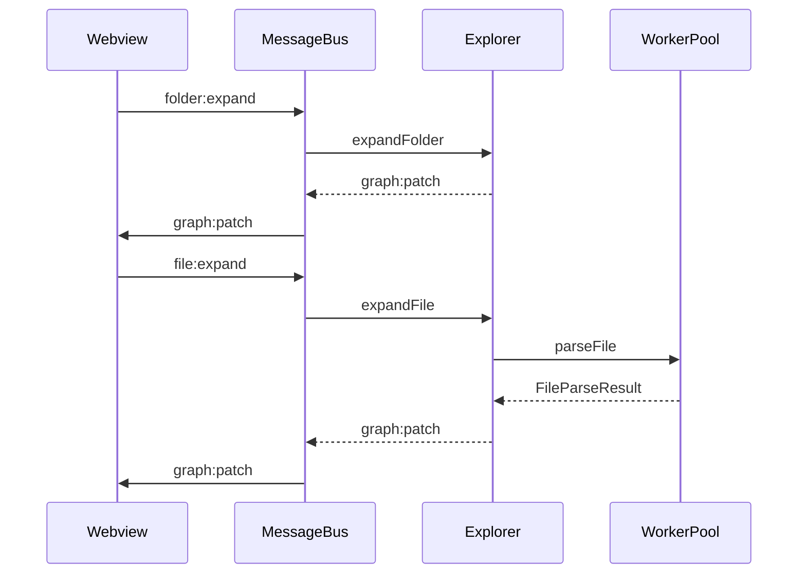

# 07 — API Flow

Commands, messages, worker IPC, and examples.

---

## VS Code commands

Defined in [`package.json`](../package.json) `contributes.commands`; handlers in [`activate.ts`](../src/extension/activate.ts).

| Command ID | Title | Behavior |
|------------|-------|----------|
| `codemap.openArchitecture` | CodeMap: Open Architecture | `createOrShow` + `bootstrap()` |
| `codemap.refreshGraph` | CodeMap: Refresh Graph | `refresh()` if panel exists; else create + bootstrap |

No views, settings, or keybindings are contributed yet.

---

## Extension ↔ webview protocol

Schemas: [`shared/messages.ts`](../shared/messages.ts).

### Extension → webview

| `type` | Payload | When |
|--------|---------|------|
| `graph:full` | `GraphSnapshot` | Bootstrap / refresh root replace |
| `graph:patch` | `GraphPatch` | Expand/collapse/FS updates |
| `progress` | `{ message, percent? }` | Loading / parsing status |
| `error` | `{ message, scope }` | Failures (scanner, panel, message-bus, …) |
| `search:results` | `SearchResult[]` | **Schema ready; UI ignores** |

#### Example: full graph

```json
{
  "type": "graph:full",
  "payload": {
    "nodes": [
      {
        "id": "workspace:/proj",
        "kind": "Workspace",
        "label": "proj",
        "filePath": "/proj",
        "metadata": { "expanded": true }
      }
    ],
    "edges": [],
    "generatedAt": 1730000000000,
    "workspaceRoot": "/proj"
  }
}
```

#### Example: patch

```json
{
  "type": "graph:patch",
  "payload": {
    "upsertNodes": [
      {
        "id": "folder:/proj/src",
        "kind": "Folder",
        "label": "src",
        "filePath": "/proj/src",
        "metadata": { "expanded": false }
      }
    ],
    "removeNodeIds": [],
    "upsertEdges": [
      {
        "id": "hierarchy:workspace:/proj->folder:/proj/src",
        "kind": "hierarchy",
        "source": "workspace:/proj",
        "target": "folder:/proj/src"
      }
    ],
    "removeEdgeIds": []
  }
}
```

### Webview → extension

| `type` | Payload | Handler |
|--------|---------|---------|
| `ready` | — | `bootstrap()` |
| `graph:refresh` | — | `refresh()` |
| `folder:expand` | `{ path }` | `expandFolder` |
| `folder:collapse` | `{ path }` | `collapseFolder` |
| `file:expand` | `{ path }` | `expandFile` |
| `file:collapse` | `{ path }` | `collapseFile` |
| `function:expand` | `{ nodeId }` | `expandFunction` |
| `function:collapse` | `{ nodeId }` | `collapseFunction` |
| `node:open` | `{ filePath, line? }` | Open document + jump |
| `node:select` | `{ nodeId }` | **No-op** |
| `search:query` | `{ query }` | **No-op** |
| `filter:update` | `FilterState` | **No-op** |

#### Example: expand folder

```json
{
  "type": "folder:expand",
  "payload": { "path": "/proj/src" }
}
```

#### Example: open symbol

```json
{
  "type": "node:open",
  "payload": { "filePath": "/proj/src/app.ts", "line": 42 }
}
```

### Validation rules

- Host **outbound:** `parseExtensionToWebview` (throws if invalid — should not happen for typed posts).
- Host **inbound:** `safeParseWebviewToExtension`; on failure posts `error` with `scope: 'message-bus'`.
- Webview **inbound:** `safeParseExtensionToWebview`; on failure sets error banner.

---

## Worker communication

Types: [`src/parser/types.ts`](../src/parser/types.ts). Transport: Node `worker_threads` `postMessage`.

### Host → worker (`WorkerInbound`)

| `type` | Fields | Used for |
|--------|--------|----------|
| `parseFiles` | `id`, `workspaceRoot`, `files[]`, `tsconfigs[]` | Prefetch batches |
| `parseFile` | `id`, `workspaceRoot`, `file`, `tsconfigs[]` | User file expand |
| `resolveCalls` | `id`, `workspaceRoot`, `filePath`, `functionName`, `tsconfigs[]`, `content?` | Function expand |

Each request has a string `id` correlated with the response.

### Worker → host (`WorkerOutbound`)

| `type` | Fields |
|--------|--------|
| `parseResult` | `id`, `results: FileParseResult[]` |
| `resolveCallsResult` | `id`, `result: ResolveCallsResult` |
| `error` | `id`, `message` |

#### Example request

```json
{
  "type": "parseFile",
  "id": "3",
  "workspaceRoot": "/proj",
  "file": { "absolutePath": "/proj/src/a.ts" },
  "tsconfigs": [{ "configPath": "/proj/tsconfig.json", "baseDir": "/proj" }]
}
```

#### Example success

```json
{
  "type": "parseResult",
  "id": "3",
  "results": [
    {
      "filePath": "/proj/src/a.ts",
      "imports": [],
      "exports": [{ "name": "foo", "isReExport": false, "isTypeOnly": false }],
      "symbols": [
        {
          "name": "foo",
          "kind": "Function",
          "line": 1,
          "exported": true,
          "start": 0,
          "end": 40
        }
      ],
      "dependencyPaths": [],
      "dynamicImportPaths": []
    }
  ]
}
```

Host API wrappers (`WorkerPool.parseFile` etc.) hide raw IPC and return Promises.

---

## Graph model API (shared)

From [`shared/graph.ts`](../shared/graph.ts):

**NodeKind:** Workspace, Folder, File, Function, Class, Interface, Enum, Component  

**EdgeKind:** hierarchy, contains, imports, exports, calls, dynamicImport  

**GraphPatch fields:** `upsertNodes`, `removeNodeIds`, `upsertEdges`, `removeEdgeIds`

---

## Request/response pairing (user action)



## Related docs

- [11-events.md](11-events.md)
- [10-workers.md](10-workers.md)
- [15-common-workflows.md](15-common-workflows.md)
