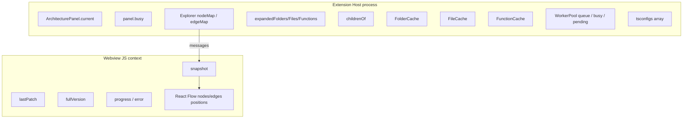

# 08 — State Management

Where state lives, who owns it, and how it stays consistent. There is **no Redux/Zustand/global store**.

---

## Global / singleton state

| Location | State | Notes |
|----------|-------|-------|
| `ArchitecturePanel.current` | Active panel instance | One panel at a time |
| `ArchitecturePanel.busy` | Bootstrap/refresh mutex | Prevents overlapping runs |
| VS Code `globalState` / `workspaceState` | **Unused** | Not persisted |
| Webview `getState` / `setState` | **Typed but unused** | Only `postMessage` used |

---

## Extension / explorer state

Owned by [`ExplorerService`](../src/explorer/ExplorerService.ts):

| Field | Meaning |
|-------|---------|
| `nodeMap` / `edgeMap` | Authoritative live graph |
| `expandedFolders` / `expandedFiles` / `expandedFunctions` | What the user has opened (for refresh/re-expand) |
| `childrenOf` | Parent → child ids for collapse |
| `workspaceRoot` | Active root |
| `tsconfigs` | Accumulated tsconfig infos for the parser |
| `prefetch` | Current `BackgroundPrefetch` or undefined |

**Caches** (also owned by explorer):

| Cache | Key | Value |
|-------|-----|-------|
| FolderCache | dir path | `DirectoryListing` |
| FileCache | file path | `CachedFileParse` (+ hash); disk-backed |
| FunctionCache | symbol nodeId | callees |
| FileSystemDiskCache | sanitized path key | JSON under `~/.codemap/cache` |

**Consistency rule:** Host maps are updated **before** emitting patches. Webview applies the same patch independently — it does not “own” truth.

---

## Worker pool state

Owned by [`WorkerPool`](../src/parser/workerPool.ts):

| Field | Meaning |
|-------|---------|
| `worker` | Active `Worker` or undefined |
| `queue` | Pending jobs (priority ordered) |
| `pending` | In-flight id → Promise callbacks |
| `busy` | Whether a job is currently with the worker |
| `nextId` | Monotonic request id |

---

## React / webview state

### `useExtensionMessages`

| State | Role |
|-------|------|
| `snapshot` | Current `GraphSnapshot` or null |
| `lastPatch` | Last applied patch (for incremental layout) |
| `fullVersion` | Counter bumped on every full snapshot |
| `progress` | Status string |
| `error` | Error banner string |
| `layoutEngine` | `'elk' \| 'dagre' \| …` hint for UI |

### `ArchitectureGraph` (React Flow)

| State | Role |
|-------|------|
| `useNodesState` / `useEdgesState` | Rendered RF graph including drag positions |

**Important:** On patch, existing node positions are preserved; only new node ids get `layoutNewNodes` coordinates. On `fullVersion` change, full relayout runs.

---

## Ephemeral vs durable

| Kind | Durable across panel close? | Durable across VS Code restart? |
|------|-----------------------------|----------------------------------|
| Explorer maps / expansion | No | No |
| Folder / function caches | No | No |
| FileCache (memory) | No | No |
| FileCache (disk) | Yes | Yes (until TTL / invalidate) |
| Webview RF positions | No (unless panel hidden with retainContext) | No |

`retainContextWhenHidden: true` keeps webview JS alive while the panel is hidden (not closed), so React state can survive tab switches. Disk cache restores **parse results only**, not expansion or layout.

---

## Update patterns

| Trigger | Host update | Webview update |
|---------|-------------|----------------|
| Bootstrap | Replace maps; emit full | Replace snapshot |
| Expand | Mutate maps; emit patch | `applyGraphPatch` |
| Collapse | Remove descendants; emit patch | Same |
| Refresh | Clear + rebuild + re-expand | Full then patches |
| FS change | Invalidate + re-expand if open | Patches |

## Related docs

- [09-database.md](09-database.md)
- [06-data-flow.md](06-data-flow.md)
