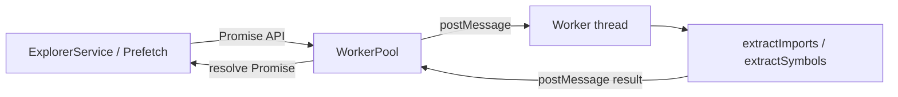

# 10 — Workers

## Why workers exist

Parsing TypeScript with the compiler API (create source files, resolve modules, walk ASTs) is **CPU-heavy**. If it ran on the extension host thread, VS Code UI (and the webview message loop) would stutter during file expands and prefetch.

CodeMap moves parse/resolve work into a **Node `worker_threads` Worker**. The host only queues jobs and applies results.

---

## Architecture



| Piece | File |
|-------|------|
| Host pool | [`src/parser/workerPool.ts`](../src/parser/workerPool.ts) |
| Worker entry | [`src/parser/workers/parseWorker.ts`](../src/parser/workers/parseWorker.ts) |
| Bundle output | `out/parser/workers/parseWorker.js` |
| Script path set by | `ArchitecturePanel` constructor (`join(extensionUri, 'out/parser/workers/parseWorker.js')`) |

---

## Worker lifecycle

1. **Not started at panel open.** `WorkerPool` creates the worker on first `ensureWorker()` call (first parse/resolve).
2. **Alive** while the pool holds `this.worker` and jobs succeed.
3. **On worker `error` or non-zero `exit`:** pending Promises reject; queue cleared; `worker` set to `undefined`. Next job recreates the worker.
4. **On panel dispose:** `pool.dispose()` → `worker.terminate()`, clear queue/pending.

Resource limit: `maxOldGenerationSizeMb` defaults to **1536**.

---

## Thread communication

- **Protocol:** request/response with correlating string `id` (see [07-api-flow.md](07-api-flow.md)).
- **Inbound types:** `parseFiles`, `parseFile`, `resolveCalls`.
- **Outbound types:** `parseResult`, `resolveCallsResult`, `error`.
- **Serialization:** structured clone via `postMessage` (plain JSON-like objects).

The worker script asserts `parentPort` exists; it is not meant to run as a main thread entry.

---

## Pool behavior (single worker + priority queue)

Despite the name “pool,” there is **one** worker. Concurrency = 1.

| Priority | Who uses it | Queue behavior |
|----------|-------------|----------------|
| `high` (default) | User `parseFile` / `resolveCalls` | Inserted before the first `low` item |
| `low` | `BackgroundPrefetch.parseFiles` | Appended at end |

`pump()`:

1. If busy or queue empty → return.
2. Dequeue one item.
3. `ensureWorker()`, set `busy`, store pending by id, `postMessage`.

When a response arrives → resolve/reject → `busy = false` → `pump()` again.

---

## How parsing happens inside the worker

```
parseWorker receives parseFile / parseFiles
        ↓
extractImports.parseFile(s)
        ↓
Load/pick tsconfig project
        ↓
ts.createSourceFile
        ↓
Extract imports/exports (resolveModuleName)
        ↓
extractSymbols
        ↓
Barrel hop (one level) → dependencyPaths
        ↓
Return FileParseResult[]
```

`resolveCalls`:

```
resolveCalls(workspaceRoot, filePath, functionName, tsconfigs, content?)
        ↓
resolveFunctionCallees on that function’s AST span
        ↓
CalleeRef[] (local / targetFile / async heuristic)
```

---

## Worker responsibilities (and non-responsibilities)

**Does:**

- AST parse
- Module path resolution (workspace files)
- Symbol + callee extraction

**Does not:**

- Talk to the webview
- Update caches (host does)
- Emit graph patches
- Recurse the whole workspace

---

## Error handling

| Layer | Behavior |
|-------|----------|
| Per-file in `parseFiles` | Catch → `FileParseResult.error`, empty arrays for that file |
| `resolveCalls` library | May return `{ callees: [], error }` |
| Worker catch-all | `{ type: 'error', id, message }` |
| WorkerPool on `error` response | `pending.reject(Error)` |
| Worker process error/exit | Reject all pending; reset worker |
| Prefetch | Catch batch failure; remove paths from queued set; continue |
| Explorer / Panel | Surface as `error` / progress messages to webview |

---

## Debugging tips

- Breakpoints in **host** `WorkerPool.enqueue` / message handler show queue behavior.
- Breakpoints inside **worker** source require attaching to the worker (or temporarily calling extractors on the host in tests).
- Unit tests often call `parseFile` / `resolveCalls` **without** the worker via test helpers.
- If the worker script path is wrong (not compiled), first expand fails with worker startup errors.

## Related docs

- [16-debugging-guide.md](16-debugging-guide.md)
- [12-function-reference.md](12-function-reference.md) — WorkerPool / extractors
