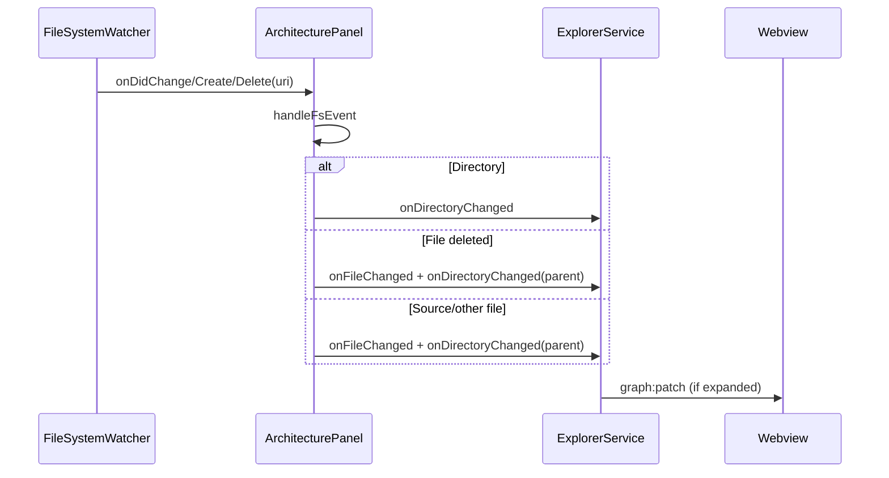

# 11 — Events

Who emits what, who listens, and what happens next.

---

## VS Code / extension events

| Event / trigger | Emitter | Listener | Effect |
|-----------------|---------|----------|--------|
| Command `codemap.openArchitecture` | User / Command Palette | `activate.ts` handler | `createOrShow` + `bootstrap` |
| Command `codemap.refreshGraph` | User | `activate.ts` handler | `refresh` or create+bootstrap |
| Extension deactivate | VS Code | `deactivate()` | Dispose panel |
| `panel.onDidDispose` | WebviewPanel | `ArchitecturePanel.dispose` | Tear down explorer, pool, watcher |
| `webview.onDidReceiveMessage` | Webview | `MessageBus.onMessage` | Validate → `handleWebviewMessage` |
| `FileSystemWatcher` change/create/delete | VS Code FS | `handleFsEvent` | `onFileChanged` / `onDirectoryChanged` |

---

## Message events (extension ↔ webview)

### Webview → extension

| Message | Emitted by | Handled by | Effect |
|---------|------------|------------|--------|
| `ready` | `useExtensionMessages` mount | Panel | `bootstrap()` |
| `graph:refresh` | App Refresh button | Panel | `refresh()` |
| `folder:expand` / `collapse` | ArchitectureGraph double-click | Panel → Explorer | Patch hierarchy |
| `file:expand` / `collapse` | ArchitectureGraph | Panel → Explorer | Parse / remove symbols |
| `function:expand` / `collapse` | ArchitectureGraph | Panel → Explorer | Call edges |
| `node:open` | ArchitectureGraph (Ctrl/Cmd+dblclick) | Panel | Open editor + line |
| `node:select` | (possible future) | Panel | No-op |
| `search:query` | (future) | Panel | No-op |
| `filter:update` | (future) | Panel | No-op |

### Extension → webview

| Message | Emitted by | Handled by | Effect |
|---------|------------|------------|--------|
| `graph:full` | Panel (from explorer) | `useExtensionMessages` | Replace snapshot; `fullVersion++` |
| `graph:patch` | Panel | Hook | `applyGraphPatch`; set `lastPatch` |
| `progress` | Panel | Hook | Status text |
| `error` | Panel / MessageBus | Hook | Error banner |
| `search:results` | (unused) | Hook | Ignored |

---

## Worker events

| Event | Emitter | Listener | Effect |
|-------|---------|----------|--------|
| `worker.postMessage(request)` | WorkerPool.pump | parseWorker `message` | Run parse/resolve |
| `port.postMessage(response)` | parseWorker | WorkerPool `message` | Resolve/reject Promise; pump next |
| Worker `error` | Worker runtime | WorkerPool | Reject all pending; reset |
| Worker `exit` (nonzero) | Worker runtime | WorkerPool | Reject pending; reset |

---

## Filesystem events

| Explorer method | Cache action | Graph action if expanded |
|-----------------|--------------|---------------------------|
| `onFileChanged` | Invalidate FileCache + FunctionCache for path | `collapseFile` then `expandFile` |
| `onDirectoryChanged` | Invalidate FolderCache | Remove children; `expandFolder` again |

Watcher errors are swallowed in `handleFsEvent`.

---

## React / UI events

| UI event | Component | Effect |
|----------|-----------|--------|
| Mount | `useExtensionMessages` | Listen `window.message`; send `ready` once |
| Click Refresh | `App` | `postToExtension({ type: 'graph:refresh' })` |
| Double-click node | `ArchitectureGraph` | Toggle expand/collapse by kind |
| Ctrl/Cmd + double-click | `ArchitectureGraph` | `node:open` with filePath/line |
| Drag node | React Flow | Updates RF node position (kept across patches) |
| Layout engine change | App / hook | Updates `layoutEngine` display (layout still ELK→Dagre internally on full) |

### Expand/collapse mapping (double-click)

| Node kind | Message when collapsed → expand | When expanded → collapse |
|-----------|----------------------------------|---------------------------|
| Workspace / Folder | `folder:expand` | `folder:collapse` (workspace collapse blocked on host for root) |
| File | `file:expand` | `file:collapse` |
| Function / Component / Class / … | `function:expand` | `function:collapse` |

Exact gesture handling lives in [`ArchitectureGraph.tsx`](../src/webview/components/ArchitectureGraph.tsx).

---

## Explorer emit events (internal callback)

Not VS Code events — callback from Explorer → Panel:

| Emit field | Becomes message |
|------------|-----------------|
| `full` | `graph:full` |
| `patch` | `graph:patch` |
| `progress` | `progress` |
| `error` | `error` |

---

## Event timing notes

- Bootstrap may be triggered by **both** the command and `ready`; `busy` serializes.
- Prefetch does **not** emit graph events — only fills FileCache.
- Invalid Zod messages never reach Explorer; they become `error` events instead.

## Related docs

- [07-api-flow.md](07-api-flow.md)
- [15-common-workflows.md](15-common-workflows.md)
- [03-runtime-flow.md](03-runtime-flow.md)
