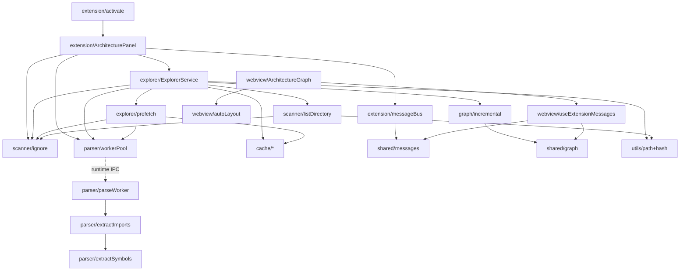
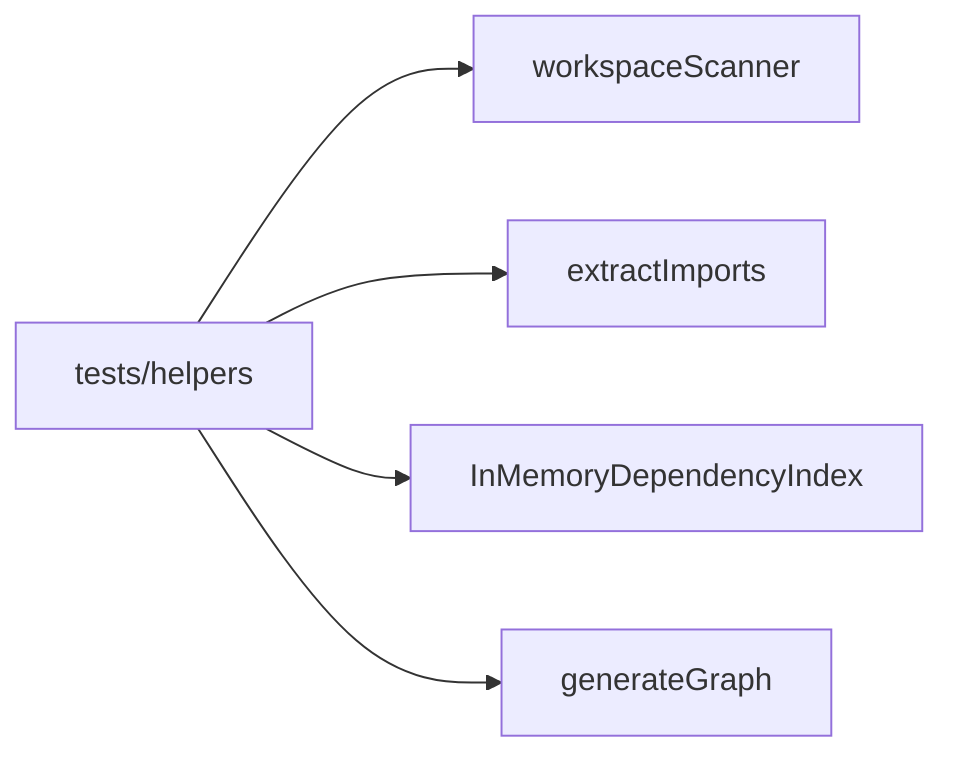

# 13 — Dependency Graph

Why each module depends on another. Edges are intentional — not accidental coupling.

---

## Layer rules

| Layer | May depend on | Must not depend on |
|-------|---------------|--------------------|
| `shared/` | zod only | `src/*`, vscode, react |
| `utils/`, `scanner/ignore` | node builtins | explorer, webview |
| `parser/` | typescript, utils types | vscode, webview |
| `cache/` | parser types, scanner types | panel, webview |
| `graph/` | shared graph, utils | webview |
| `explorer/` | scanner, parser pool, cache, graph | webview, vscode (mostly) |
| `extension/` | everything host-side + vscode | react |
| `webview/` | shared, react, layout libs | `vscode` node module, explorer |

The dashed edge `WorkerPool → parseWorker` is **runtime** (script path), not a TypeScript import.

---

## Why each important edge exists

### `activate` → `ArchitecturePanel`

Commands need a single place that owns the panel lifecycle. Keeping `activate.ts` thin avoids mixing VS Code registration with orchestration.

### `ArchitecturePanel` → `MessageBus` / `ExplorerService` / `WorkerPool`

The panel is the **composition root**. It owns disposal order (explorer → pool → panel). The pool script path needs `extensionUri`, which only the panel has.

### `ArchitecturePanel` → `ignore.isSourceFile`

FS watcher must decide whether a changed path is a source file worth invalidating as a parse target.

### `MessageBus` → `shared/messages`

Both sides must agree on wire format. Central Zod schemas prevent drift between host posts and webview handlers.

### `ExplorerService` → `listDirectory` (not `workspaceScanner`)

Live UI prioritizes shallow listing. Full recursive scan would defeat the &lt;200ms open target. `workspaceScanner` remains for tests.

### `ExplorerService` → caches

Caches are implementation details of exploration speed. Keeping them inside the explorer (not global singletons) ties their lifetime to the panel.

### `ExplorerService` → `WorkerPool`

Parsing must be async and off-thread. Explorer never imports extractors directly — only the pool API — so the host bundle does not pull the full TS compiler into the wrong place unnecessarily (worker bundle owns that).

### `ExplorerService` → `graph/incremental`

Stable IDs and patch helpers keep expand/collapse consistent. Duplicating ID logic in the explorer would cause stub/rewire bugs.

### `BackgroundPrefetch` → `WorkerPool` with `priority: 'low'`

Prefetch must not starve user expands. The priority edge is why the pool API exists instead of a simple fire-and-forget worker.

### `parseWorker` → `extractImports` → `extractSymbols`

Worker is a thin IPC shell. All AST intelligence stays testable as plain functions.

### `incremental` / webview → `shared/graph.applyGraphPatch`

Host mutates maps; webview applies immutably. Same algorithm, shared module — avoids two incompatible patch semantics.

### `ArchitectureGraph` → `autoLayout`

Layout is pure enough to unit-test separately from React Flow. Graph component stays about gestures and RF state.

### `webview` → `shared` only (for domain)

Webview must not import explorer — that would pull Node FS into the browser bundle.

---

## Test-only dependency path

**Why separate:** fixture tests need a deterministic full snapshot without spinning up VS Code or a webview.

---

## Circular dependency policy

There should be **no cycles** among `shared → utils → scanner → parser → cache → graph → explorer → extension`. Webview sits beside extension, connected only through messages + shared types.

If you introduce a cycle (e.g. graph importing explorer), stop and rethink ownership.

## Related docs

- [04-architecture.md](04-architecture.md)
- [02-folder-structure.md](02-folder-structure.md)
