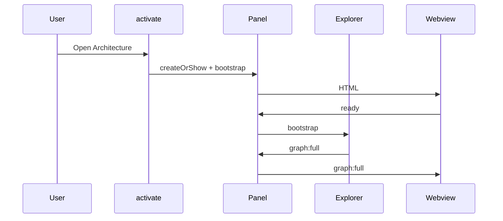

# 15 — Common Workflows

Step-by-step walkthroughs of frequent operations.

---

## 1. Opening the extension

1. User runs **CodeMap: Open Architecture**.
2. VS Code activates the extension if needed → `activate`.
3. `ArchitecturePanel.createOrShow` creates the webview (or reveals existing).
4. Constructor builds bus, pool, explorer, HTML, watcher.
5. Command calls `bootstrap()`; webview mounts and sends `ready` (may also bootstrap).
6. Explorer lists workspace root → `graph:full`.
7. Webview runs `layoutGraph` → React Flow shows Workspace + children.

---

## 2. Expanding a folder

1. User double-clicks a Folder (or Workspace child folder).
2. Webview posts `{ type: 'folder:expand', path }`.
3. Panel → `explorer.expandFolder(path)`.
4. Cache hit or `listDirectory`.
5. Upsert child Folder/File nodes + hierarchy edges; mark expanded.
6. `graph:patch` → webview `layoutNewNodes`.
7. Prefetch enqueues source files at low priority (FileCache only).

---

## 3. Expanding / parsing a file

1. Double-click a File node (source extension).
2. `{ type: 'file:expand', path }`.
3. `ensureParsed`: `FileCache.getIfFresh` or `pool.parseFile`.
4. Worker parses AST → symbols, imports, deps.
5. Patch: symbol nodes + `contains`; import/dynamicImport edges; lazy file stubs; rewire prior calls.
6. Webview updates graph.

Non-source files (README, package.json): expand is a no-op for symbols.

---

## 4. Expanding a function (call graph)

1. Double-click a Function/Component/… node.
2. `{ type: 'function:expand', nodeId }`.
3. Cache or `pool.resolveCalls`.
4. For each callee: edge to local symbol, expanded remote symbol, or file stub.
5. `graph:patch`.

---

## 5. Opening a node in the editor

1. Ctrl/Cmd + double-click a node with `filePath`.
2. `{ type: 'node:open', filePath, line? }`.
3. Panel opens the document and jumps to line (1-based → 0-based Position).

---

## 6. Collapsing

| Target | Message | Host effect |
|--------|---------|-------------|
| Folder | `folder:collapse` | Remove descendants (not workspace root) |
| File | `file:collapse` | Remove symbols + import/contains edges |
| Function | `function:collapse` | Remove outbound `calls` edges |

Metadata `expanded: false` updated on the parent node.

---

## 7. Refreshing the graph

**Triggers:** Command Palette **CodeMap: Refresh Graph**, or UI Refresh → `graph:refresh`.

1. Snapshot expanded folder/file/function sets.
2. Clear all caches.
3. `bootstrap` → `graph:full`.
4. Re-expand each remembered path/id → series of patches.

If no panel exists, refresh command creates one and bootstraps.

---

## 8. Filesystem change while expanded

1. Watcher fires for a path.
2. Panel classifies directory vs file vs delete.
3. Invalidate FolderCache and/or FileCache + FunctionCache.
4. If that folder/file is expanded → remove children / collapse + expand again.
5. Webview receives patches reflecting new children or reparsed symbols.

---

## 9. Background prefetch

1. After successful `expandFolder`, prefetch gets child source paths.
2. Skips already cached/queued files.
3. Batches of 8 with `priority: 'low'`.
4. Results go to FileCache only.
5. Later user `expandFile` often hits cache → faster.

Cancelled on refresh/dispose/clearState.

---

## 10. Worker / parse error

1. Worker returns `error` or per-file `FileParseResult.error`.
2. Pool rejects Promise or explorer stores `parseError` on file metadata.
3. Panel may post `{ type: 'error', scope, message }` for thrown failures.
4. Webview shows error banner; partial graph may still render.

Prefetch failures are swallowed (no banner) so background work stays quiet.

---

## 11. Call edge rewiring

1. Function A calls `foo` in unexpanded module B → edge to File stub B.
2. User expands file B → symbols include `foo`.
3. `rewireCallsToFile` removes stub-targeted call edges and upserts edges to symbol `foo`.

---

## 12. Closing the panel

1. User closes webview tab.
2. `onDidDispose` → `dispose()`.
3. Prefetch cancelled; maps cleared; worker terminated; singleton cleared.

Reopening starts fresh (no disk restore).

## Related docs

- [03-runtime-flow.md](03-runtime-flow.md)
- [11-events.md](11-events.md)
- [16-debugging-guide.md](16-debugging-guide.md)
