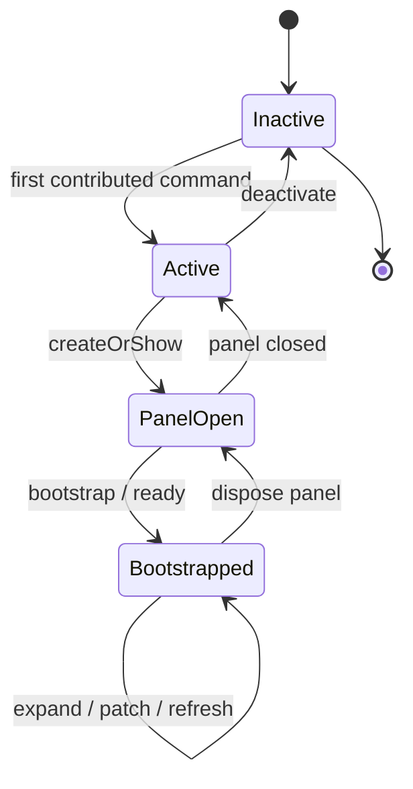

# 17 — Extension Lifecycle

Lifecycle of the VS Code extension from activation through disposal.



---

## Activation

[`package.json`](../package.json) sets `"activationEvents": []`. On modern VS Code, **contributing commands** still activates the extension when those commands run.

**Entry:** `main` → `./out/extension.js` (bundled from [`src/extension/activate.ts`](../src/extension/activate.ts)).

### `activate(context)`

1. Register `codemap.openArchitecture`.
2. Register `codemap.refreshGraph`.
3. Push both disposables onto `context.subscriptions` so VS Code disposes them on unload.

No panel, worker, or scanner starts until a command runs.

---

## Command registration

| Command | On invoke |
|---------|-----------|
| Open Architecture | `createOrShow` then `bootstrap()` |
| Refresh Graph | If `current` → `refresh()`; else create + `bootstrap()` |

Commands remain registered for the lifetime of the activation.

---

## Panel creation

`ArchitecturePanel.createOrShow(extensionUri)`:

1. If `current` exists → `panel.reveal` and return it.
2. Else `createWebviewPanel` with:
   - `enableScripts: true`
   - `retainContextWhenHidden: true`
   - `localResourceRoots: out/webview`
3. Construct `ArchitecturePanel` → assign `current`.

### Constructor sequence

1. `MessageBus(webview)`
2. `WorkerPool({ workerScript: …/parseWorker.js })` — worker not spawned yet
3. `ExplorerService(pool, emitBridge)`
4. Set `webview.html` (CSP + script)
5. Subscribe `bus.onMessage` → `handleWebviewMessage`
6. Subscribe `onDidDispose` → `dispose`
7. `setupWatcher()` if workspace folders exist

---

## Message handling loop

While the panel is open:

```
webview postMessage
  → MessageBus safeParse
  → handleWebviewMessage switch
      ready / refresh / expand* / collapse* / node:open / no-ops
  → explorer or vscode editor APIs
  → emit → bus.post graph/progress/error
  → webview updates React state
```

`busy` guards overlapping `bootstrap`/`refresh` only (not every expand).

---

## Worker startup

- Lazy: first `parseFile` / `parseFiles` / `resolveCalls` calls `ensureWorker()`.
- Script: absolute path under the extension install/`out` directory.
- Stays alive across expands until error/exit/dispose.

---

## Worker shutdown

Triggered by:

1. `ArchitecturePanel.dispose()` → `pool.dispose()` → `worker.terminate()`
2. Unexpected worker crash → pool clears and sets `worker = undefined` (next job recreates)

Prefetch is cancelled before explorer clear so it does not enqueue after teardown.

---

## Filesystem watcher lifecycle

- Created in constructor via `setupWatcher`.
- Disposed with other `disposables` in `dispose()`.
- Not recreated on refresh (same panel instance keeps the watcher).

---

## `dispose()`

Order matters:

1. `ArchitecturePanel.current = undefined`
2. `explorer.dispose()` — cancel prefetch, clear maps/caches
3. `await pool.dispose()` — terminate worker (fire-and-forget void in practice)
4. `panel.dispose()` — destroy webview
5. Dispose remaining subscriptions (bus listener, watcher)

Also invoked from `deactivate()` if a panel still exists.

---

## `deactivate()`

```ts
ArchitecturePanel.current?.dispose();
```

VS Code also disposes `context.subscriptions` (command registrations). Panel dispose is explicit so the worker does not leak after unload.

---

## Bootstrap / ready race

Both the command and the webview `ready` message call `bootstrap()`:

| Scenario | Behavior |
|----------|----------|
| Command bootstrap still running when `ready` arrives | Second call returns early (`busy`) |
| Command finished before `ready` | Second bootstrap resets root graph (usually identical) |
| Panel revealed again | `createOrShow` returns existing; command still calls `bootstrap` again |

This is intentional simplicity rather than a complex “already bootstrapped” flag. **Assumption:** double bootstrap after open is acceptable.

---

## Hidden vs closed

| Action | Effect |
|--------|--------|
| Switch away from panel | Webview JS kept (`retainContextWhenHidden`) |
| Close panel tab | Full `dispose()` — state lost |
| Reload Extension Host | `deactivate` + fresh `activate` |

## Related docs

- [03-runtime-flow.md](03-runtime-flow.md)
- [08-state-management.md](08-state-management.md)
- [10-workers.md](10-workers.md)
