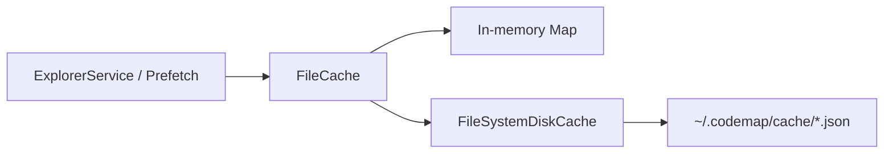

# Cache Improvements Summary

## Overview

CodeMap now persists parsed file results across Extension Host restarts via a filesystem-backed disk cache. Interactive latency stays memory-first; disk is a warm second layer.

## What changed

| Area | Before | After |
|------|--------|-------|
| `DiskCache` | Interface + `NoOpDiskCache` only | Real async API; no-op kept for tests / opt-out |
| `FileSystemDiskCache` | — | New (`src/cache/fsDiskCache.ts`) |
| `FileCache` | Sync in-memory only | Memory + disk; `getAsync` / `setAsync` / invalidate on both |
| Explorer / prefetch | Sync cache reads | Async-aware paths where parse results are loaded |

## Design

1. **Memory first** — hot path still hits the in-process `Map`.
2. **Disk second** — on miss, `getAsync` loads from `~/.codemap/cache` (or a custom dir).
3. **Write-through** — `set` / `setAsync` update memory and mark disk entries dirty / write JSON.
4. **TTL** — default 24 hours; expired entries are dropped on load.
5. **Invalidation** — path invalidate and clear remove both memory and on-disk files.

## Key files

| File | Role |
|------|------|
| [`src/cache/diskCache.ts`](../src/cache/diskCache.ts) | `DiskCache` interface + `NoOpDiskCache` |
| [`src/cache/fsDiskCache.ts`](../src/cache/fsDiskCache.ts) | JSON file persistence under `~/.codemap/cache` |
| [`src/cache/fileCache.ts`](../src/cache/fileCache.ts) | Wires memory + `FileSystemDiskCache` |

## Behavior notes

- Cache keys are path-normalized and sanitized for filenames.
- Corrupted JSON entries are skipped (and preferably deleted) without failing the panel.
- Disk I/O failures are logged and ignored so exploration still works offline or on read-only homes.
- Folder and function caches remain in-memory only for now.

## Follow-ups

- Persist folder listings if cold start listing is a bottleneck
- Explicit save flush on panel dispose
- Configurable cache directory / TTL via VS Code settings
- Marketplace packaging: document cache location for users

## Related docs

- [09-database.md](09-database.md) — storage matrix
- [14-design-decisions.md](14-design-decisions.md) — why multi-layer cache
- [08-state-management.md](08-state-management.md) — where state lives
