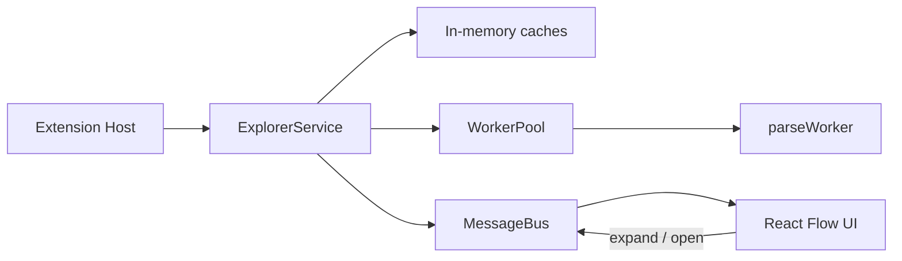

# CodeMap Documentation

Internal documentation for engineers joining the CodeMap codebase.

## Purpose

CodeMap is a **VS Code extension** that visualizes a TypeScript/JavaScript workspace as an interactive architecture graph. You expand folders, files, and functions on demand (n8n-style), rather than parsing the entire repo on open.

This `docs/` folder explains **how the system works**, **why each module exists**, and **where to change things** — so you can modify, debug, and extend the project without rediscovering the architecture from scratch.

## Architecture (one paragraph)

The extension host owns scanning, parsing, and caches. [`ArchitecturePanel`](../src/extension/ArchitecturePanel.ts) wires a [`MessageBus`](../src/extension/messageBus.ts), a [`WorkerPool`](../src/parser/workerPool.ts) (TypeScript AST in a worker thread), and an [`ExplorerService`](../src/explorer/ExplorerService.ts). The explorer lists directories lazily, expands on user action, and emits `graph:full` / `graph:patch` messages. A React webview ([`ArchitectureGraph`](../src/webview/components/ArchitectureGraph.tsx)) renders those with React Flow and ELK/Dagre layout. Shared Zod schemas in [`shared/messages.ts`](../shared/messages.ts) and [`shared/graph.ts`](../shared/graph.ts) keep both sides in sync.



## Reading order

| Order | Doc | Read when… |
|------:|-----|------------|
| 1 | [01-project-overview.md](01-project-overview.md) | You need the big picture |
| 2 | [02-folder-structure.md](02-folder-structure.md) | You need to know where files live |
| 3 | [03-runtime-flow.md](03-runtime-flow.md) | You want startup → first paint |
| 4 | [04-architecture.md](04-architecture.md) | You want module responsibilities |
| 5 | [05-module-breakdown.md](05-module-breakdown.md) | You are diving into a specific folder |
| 6 | [06-data-flow.md](06-data-flow.md) | You need to follow data transformations |
| 7 | [07-api-flow.md](07-api-flow.md) | You work on commands or messages |
| 8 | [08-state-management.md](08-state-management.md) | You need to know where state lives |
| 9 | [09-database.md](09-database.md) | You wonder about persistence (spoiler: none) |
| 10 | [10-workers.md](10-workers.md) | You debug parsing or worker crashes |
| 11 | [11-events.md](11-events.md) | You need emitter → listener maps |
| 12 | [12-function-reference.md](12-function-reference.md) | You need API-level detail |
| 13 | [13-dependency-graph.md](13-dependency-graph.md) | You need why A imports B |
| 14 | [14-design-decisions.md](14-design-decisions.md) | You need trade-off context |
| 15 | [15-common-workflows.md](15-common-workflows.md) | You want step-by-step user paths |
| 16 | [16-debugging-guide.md](16-debugging-guide.md) | Something is broken |
| 17 | [17-extension-lifecycle.md](17-extension-lifecycle.md) | You touch activate/dispose |
| 18 | [18-glossary.md](18-glossary.md) | A term is unfamiliar |

### Shortcuts

| Goal | Start here |
|------|------------|
| Debug a click that does nothing | [15](15-common-workflows.md) → [11](11-events.md) → [16](16-debugging-guide.md) |
| Add a new message type | [07](07-api-flow.md) → edit `shared/messages.ts` first |
| Add a new node kind | [06](06-data-flow.md) → `shared/graph.ts` → Nodes.tsx → explorer |
| Understand parsing | [10](10-workers.md) → [12](12-function-reference.md) parser section |
| Know what is safe to edit | See [Important files](#important-files) and [14](14-design-decisions.md) |

## Important files

| File | Role | Edit risk |
|------|------|-----------|
| [`src/extension/activate.ts`](../src/extension/activate.ts) | Extension entry: commands | Low — small surface |
| [`src/extension/ArchitecturePanel.ts`](../src/extension/ArchitecturePanel.ts) | Panel lifecycle, FS watcher, message routing | **Critical** — orchestration hub |
| [`src/explorer/ExplorerService.ts`](../src/explorer/ExplorerService.ts) | Lazy expand / collapse / patches | **Critical** — core product logic |
| [`src/parser/workerPool.ts`](../src/parser/workerPool.ts) | Worker queue & IPC | High — perf & crashes |
| [`src/parser/extractImports.ts`](../src/parser/extractImports.ts) | AST parse / import resolution | High — correctness |
| [`shared/messages.ts`](../shared/messages.ts) | Extension ↔ webview protocol | **Critical** — both sides |
| [`shared/graph.ts`](../shared/graph.ts) | Graph model + `applyGraphPatch` | **Critical** — shared contract |
| [`src/webview/components/ArchitectureGraph.tsx`](../src/webview/components/ArchitectureGraph.tsx) | React Flow UI & interactions | Medium — UX |
| [`src/webview/hooks/useExtensionMessages.ts`](../src/webview/hooks/useExtensionMessages.ts) | Webview state from messages | Medium |
| [`esbuild.mjs`](../esbuild.mjs) | Bundles extension, worker, webview | Medium — build breakage |

### Safe-to-edit vs critical

- **Safer:** styles (`src/webview/styles.css`), custom node shells (`Nodes.tsx`), ignore rules (`scanner/ignore.ts`), layout tuning (`autoLayout.ts`), docs.
- **Touch carefully:** shared Zod schemas, `ExplorerService`, `ArchitecturePanel`, worker IPC types.
- **Stubs / unused:** empty files under `scanner/` (`detector`, `fileWalker`, …), `commands/scanProject.ts`, `utils/fs.ts`, `diskCache` (`NoOpDiskCache`). Do not assume they are wired up.

## Two pipelines (do not confuse them)

1. **Live UI** — `listDirectory` + `ExplorerService` + incremental patches. This is what users see.
2. **Tests / full snapshot** — `scanWorkspace` + `InMemoryDependencyIndex` + `generateGraph`. Used by unit tests in `tests/`.

## Quick start for docs readers

```bash
npm install
npm run compile
# F5 in VS Code → Extension Development Host
# Command Palette → "CodeMap: Open Architecture"
```

See also: root [`README.md`](../README.md).
